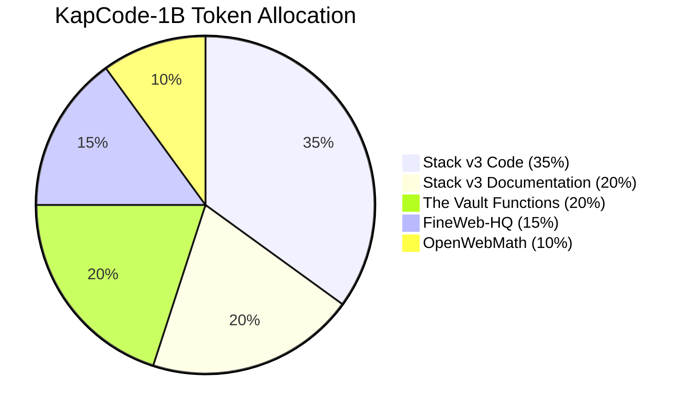
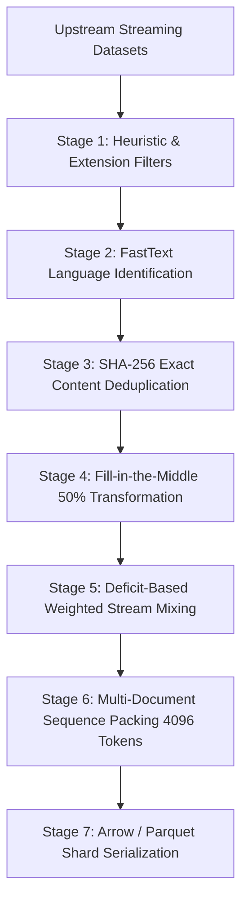

# KapCode-1B: Curated 1-Billion Token Dataset for Compact Code Models

[](https://opensource.org/licenses/Apache-2.0)
[](#dataset-composition)
[](#target-languages)
[](https://github.com/rudy-07/QaptaanLM-0.75B)

**KapCode-1B** is a high-quality, 1-billion-token curated dataset designed for **Continued Pre-Training (CPT)** and domain adaptation of compact Large Language Models. Engineered specifically to empower models under 1 billion parameters with robust code generation, technical comprehension, mathematical reasoning, and Fill-in-the-Middle (FIM) infilling capabilities, KapCode-1B combines multi-lingual code, architecture documentation, function-level snippets, high-quality STEM web text, and formal mathematical proofs.

---

## Dataset Overview

- **Repository**: `kaptaan45/KapCode-1B`
- **Total Usable Tokens**: $1,000,000,000$ (1 Billion) post-filtering and deduplication
- **Packed Sequence Length**: 4096 tokens per sequence
- **Total Packed Sequences**: 244,140 sequences
- **Primary Formats**: Memory-mapped Apache Arrow (`.arrow`) and Apache Parquet (`.parquet`) shards (~50MB / 2,000 sequences per shard)
- **Tokenization Schema**: Qwen3.5 BPE Vocabulary ($V = 248,320$) with `<|endoftext|>` sequence separators and `<|fim_prefix|>`, `<|fim_middle|>`, `<|fim_suffix|>` delimiters
- **Primary Use Case**: Full-parameter Continued Pre-Training (CPT) for models such as [QaptaanLM-0.75B](https://github.com/rudy-07/QaptaanLM-0.75B).

---

## Motivation

Training or adapting compact language models ($\le 1\text{B}$ parameters) requires substantially higher data quality and signal density than larger models. Unfiltered code repositories often contain repetitive auto-generated files, minified build outputs, vendor directories, lockfiles, and broken syntax that degrade model performance. 

KapCode-1B was constructed to address this by:
1. **Curating High-Signal Data**: Selecting balanced proportions across complete source code, developer documentation, function-level code with docstrings, technical web articles, and mathematical reasoning.
2. **Eliminating Low-Value Content**: Rejecting minified assets, lockfiles, autogenerated protobufs, vendor subtrees, and boilerplate notices.
3. **Equipping Infilling Capabilities**: Applying 50% Fill-in-the-Middle (FIM) transformation to source code files.
4. **Optimizing Training Throughput**: Packing sequences to 4096 tokens to eliminate padding waste and enable fast, zero-copy memory-mapped loading on GPU and TPU accelerators.

---

## Dataset Composition

KapCode-1B is composed of five specialized partitions sampled according to target token allocations:

| Partition | Upstream Source | Proportion | Token Count | Key Characteristics |
| :--- | :--- | :---:| :---:| :--- |
| **Source Code** | `HuggingFaceCode/stack-v3-train` | **35%** | 350,000,000 | Multi-language source code filtered for quality, permissively licensed |
| **Technical Documentation** | `HuggingFaceCode/stack-v3-train` | **20%** | 200,000,000 | Architecture guides, READMEs, Markdown references, and API docs |
| **Function-Level Code** | `Fsoft-AIC/the-vault-function` | **20%** | 200,000,000 | Individual functions with docstrings, parameters, and return types |
| **High-Quality Web** | `epfml/FineWeb-HQ` | **15%** | 150,000,000 | Top educational and STEM English web articles |
| **Mathematical Reasoning** | `open-web-math/open-web-math` | **10%** | 100,000,000 | LaTeX equations, step-by-step mathematical proofs, and literature |
| **Total** | | **100%** | **1,000,000,000** | |



---

## Target Languages

Within the code subsets, 13 programming languages and infrastructure configurations are represented according to the following distribution:

| Language | Target Proportion | File Extensions / Match Patterns |
| :--- | :---:| :--- |
| **Python** | **25%** | `.py` |
| **TypeScript** | **13%** | `.ts`, `.tsx` |
| **JavaScript** | **10%** | `.js`, `.jsx`, `.mjs` |
| **SQL** | **9%** | `.sql` |
| **C++** | **7%** | `.cpp`, `.hpp`, `.cc`, `.cxx` |
| **Shell / Bash** | **6%** | `.sh`, `.bash`, `.zsh` |
| **C** | **5%** | `.c`, `.h` |
| **Java** | **5%** | `.java` |
| **HTML** | **5%** | `.html`, `.htm` |
| **Rust** | **4%** | `.rs` |
| **Go** | **4%** | `.go` |
| **CSS** | **4%** | `.css`, `.scss` |
| **Dockerfile / IaC / Config** | **3%** | `Dockerfile`, `docker-compose.yml`, `.github/workflows/*.yml`, `Cargo.toml`, `pyproject.toml`, `Makefile` |

---

## Curation and Processing Pipeline



### 1. Heuristic and Structural Filtering
- **File Size Bounds**: Files $< 100\text{ bytes}$ or $> 1\text{ MB}$ are excluded.
- **Line Constraints**: Rejects documents with lines exceeding 1,000 characters, or files with $< 3$ lines or $> 10,000$ lines.
- **Alphanumeric Density**:
  - Code: Minimum 25% alphanumeric characters.
  - Documentation: Minimum 50% alphanumeric characters.
  - Web: Minimum 60% alphanumeric characters.
- **Excluded Patterns**: Rejects 25+ binary and non-training file extensions (`.json`, `.csv`, `.xml`, `.min.js`, `.min.css`, `.lock`, `.pyc`, `.o`, `.so`, `.dll`), while explicitly preserving key configuration and build files (`Dockerfile`, `pyproject.toml`, `Cargo.toml`, CI/CD workflows).
- **Vendor / Fork Exclusions**: Strips GitHub forks and subtrees matching `node_modules/`, `vendor/`, `dist/`, `build/`, `.tox/`, `generated/`.

### 2. Language Identification (LID)
- Uses FastText (`lid.176.bin`) to classify human language in documentation and web partitions.
- Documents with an English probability score $< 0.70$ ($< 0.60$ for LaTeX-heavy mathematics) are eliminated.

### 3. Deduplication
- **Exact Deduplication**: Computes SHA-256 hashes over whitespace-normalized content strings. Documents matching previously registered hashes are discarded.

### 4. Fill-in-the-Middle (FIM) Formatting
- **50% of source code documents** are randomly transformed into Prefix-Suffix-Middle format to support bi-directional code completion:
  ```text
  <|fim_prefix|>Prefix Content<|fim_suffix|>Suffix Content<|fim_middle|>Middle Content
  ```

### 5. Sequence Packing
- Individual documents are concatenated with `<|endoftext|>` token delimiters up to the fixed 4096-token sequence length.
- Attention masks and labels are formatted to support efficient non-padded causal language modeling.

---

## Example Records

### 1. Source Code Record (Python)
```json
{
  "text": "def compute_moving_average(values: list[float], window_size: int) -> list[float]:\n    \"\"\"Compute the simple moving average over a sliding window.\"\"\"\n    if window_size <= 0:\n        raise ValueError(\"Window size must be positive\")\n    if len(values) < window_size:\n        return []\n    averages = []\n    window_sum = sum(values[:window_size])\n    averages.append(window_sum / window_size)\n    for i in range(window_size, len(values)):\n        window_sum += values[i] - values[i - window_size]\n        averages.append(window_sum / window_size)\n    return averages\n",
  "language": "Python",
  "source": "stack_v3_code"
}
```

### 2. Fill-in-the-Middle (FIM) Code Record
```json
{
  "text": "<|fim_prefix|>def compute_moving_average(values: list[float], window_size: int) -> list[float]:\n    if window_size <= 0:\n        raise ValueError(\"Window size must be positive\")\n<|fim_suffix|>\n    for i in range(window_size, len(values)):\n        window_sum += values[i] - values[i - window_size]\n        averages.append(window_sum / window_size)\n    return averages\n<|fim_middle|>    if len(values) < window_size:\n        return []\n    averages = []\n    window_sum = sum(values[:window_size])\n    averages.append(window_sum / window_size)",
  "language": "Python",
  "source": "stack_v3_code_fim"
}
```

### 3. Mathematical Reasoning Record (LaTeX)
```json
{
  "text": "Theorem: For any positive integer $n$, the sum of the first $n$ odd positive integers equals $n^2$.\n\nProof by Mathematical Induction:\n1. Base Case: For $n = 1$, the first odd integer is $1 = 1^2$. The base case holds.\n2. Inductive Hypothesis: Assume the statement holds for $n = k$, that is,\n$$\\sum_{i=1}^{k} (2i - 1) = 1 + 3 + 5 + \\dots + (2k - 1) = k^2$$\n3. Inductive Step: We must prove the statement for $n = k + 1$:\n$$\\sum_{i=1}^{k+1} (2i - 1) = \\sum_{i=1}^{k} (2i - 1) + (2(k+1) - 1) = k^2 + 2k + 1 = (k + 1)^2$$\nThus, by mathematical induction, the statement holds for all $n \\in \\mathbb{Z}^+$. $\\blacksquare$",
  "source": "openwebmath"
}
```

---

## Dataset Loading and Usage

### 1. Streaming Dataset via Hugging Face `datasets`

```python
from datasets import load_dataset

# Load the dataset in streaming mode
dataset = load_dataset("kaptaan45/KapCode-1B", split="train", streaming=True)

# Iterate over packed training sequences
for sample in dataset:
    input_ids = sample["input_ids"]
    attention_mask = sample["attention_mask"]
    print(f"Loaded sequence of length: {len(input_ids)} tokens")
    break
```

### 2. Loading Direct Shard Files with Memory Mapping

```python
from datasets import load_dataset
import glob

# Memory-map all Arrow or Parquet shard files
shard_files = sorted(glob.glob("data/processed/*.arrow"))
dataset = load_dataset("arrow", data_files=shard_files, split="train", keep_in_memory=False)

print(f"Total packed sequences available: {len(dataset):,}")
print(f"First sequence token shape: {len(dataset[0]['input_ids'])}")
```

---

## Intended Use and Scope

### Intended Applications
- **Pre-Training & Continued Pre-Training (CPT)**: Foundation training for code and technical language models under 1B parameters.
- **Fill-in-the-Middle Adaptation**: Equipping existing foundation models with code completion and infilling capabilities.
- **Technical Reasoning Adaptation**: Enhancing STEM and multi-step algorithmic reasoning in lightweight models.

### Out-of-Scope Applications
- General non-English conversational dialogue.
- Instruction fine-tuning without an additional SFT phase (this dataset is designed for pre-training, not chat alignment).
- Safety-critical code generation without human verification.

---

## Limitations and Ethical Considerations

- **Licensing Compliance**: All source code samples are curated from permissively licensed open-source repositories (MIT, Apache 2.0, BSD). Users should review upstream licensing requirements for downstream deployments.
- **Biases in Code**: Code repositories reflect developer idioms and stylistic preferences present on public repositories.
- **Code Correctness**: While extensive heuristic filtering is applied, no guarantee of semantic or bug-free code execution is provided. Model outputs trained on this corpus should be executed within isolated sandbox environments.

---

## Licensing and Attribution

KapCode-1B is released under the **Apache 2.0 License**.

### Upstream Attribution
- **The Stack v3**: Developed by BigCode / Hugging Face.
- **The Vault**: Developed by FPT Software AI Center (Fsoft-AIC).
- **FineWeb-HQ**: Developed by EPFL / Hugging Face.
- **OpenWebMath**: Developed by OpenWebMath team.

---

## Citation

```bibtex
@misc{kapcode1b2026,
  title   = {{KapCode-1B}: A Curated 1-Billion Token Dataset for Compact Code Models},
  author  = {Rudy and Contributors},
  year    = {2026},
  url     = {https://huggingface.co/datasets/kaptaan45/KapCode-1B},
  note    = {Hugging Face Dataset}
}
```

```bibtex
@misc{qaptaanlm2026,
  title   = {{QaptaanLM-0.75B}: Efficient Hybrid Attention Language Model for Code and Technical Reasoning},
  author  = {Rudy and Contributors},
  year    = {2026},
  url     = {https://github.com/rudy-07/QaptaanLM-0.75B},
  note    = {GitHub Repository and Foundation Model}
}
```
