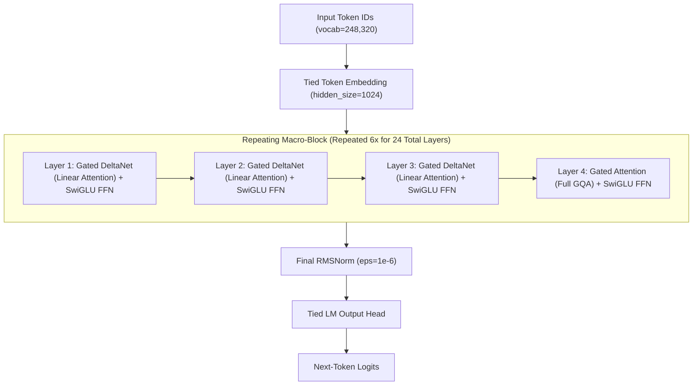
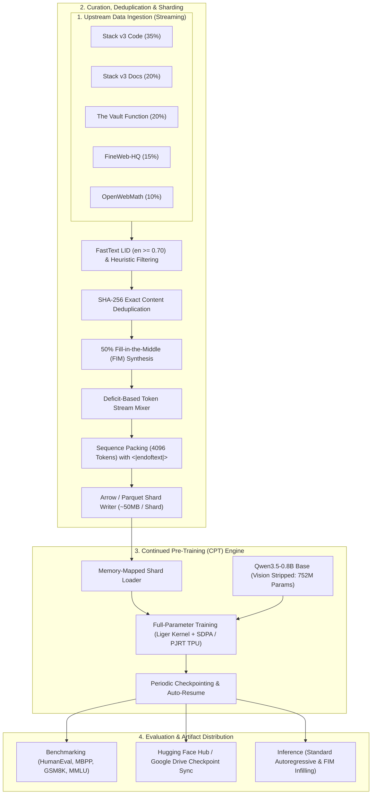
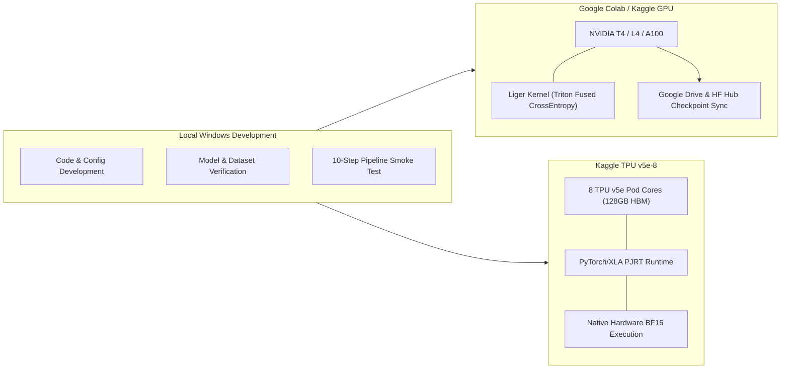

# QaptaanLM-0.75B

[](https://www.python.org/)
[](https://pytorch.org/)
[](https://github.com/huggingface/transformers)
[](LICENSE)
[](https://huggingface.co/datasets/kaptaan45/KapCode-1B)
[](https://huggingface.co/datasets/kaptaan45/KapInstruct-100M)
[](https://cloud.google.com/tpu)

**QaptaanLM-0.75B** is an efficient, compact hybrid-attention foundation language model optimized for source code generation, technical reasoning, and long-context code comprehension. Built by stripping the visual encoder from `Qwen/Qwen3.5-0.8B-Base` down to 752M dense parameters, the model undergoes a two-stage training lifecycle:
1. **Stage 1: Continued Pre-Training (CPT)** on **[KapCode-1B](https://huggingface.co/datasets/kaptaan45/KapCode-1B)** (1-billion-token curated code & reasoning corpus).
2. **Stage 2: Supervised Fine-Tuning (SFT)** on **[KapInstruct-100M](https://huggingface.co/datasets/kaptaan45/KapInstruct-100M)** (100-million-token multi-source instruction dataset with assistant-only loss masking).

---

## Table of Contents

- [Overview](#overview)
- [Architecture](#architecture)
  - [Hybrid Attention Mechanism](#hybrid-attention-mechanism)
  - [End-to-End Pipeline](#end-to-end-pipeline)
  - [Distributed Training Topology](#distributed-training-topology)
- [Model Specification](#model-specification)
- [Dataset Mixtures](#dataset-mixtures)
  - [KapCode-1B (CPT Dataset)](#kapcode-1b-cpt-dataset)
  - [KapInstruct-100M (SFT Dataset)](#kapinstruct-100m-sft-dataset)
  - [Data Sources](#data-sources)
  - [Target Programming Languages](#target-programming-languages)
  - [Data Filtering and Quality Control](#data-filtering-and-quality-control)
  - [Fill-in-the-Middle (FIM) Transformation](#fill-in-the-middle-fim-transformation)
- [Training Infrastructure](#training-infrastructure)
  - [Speed and Memory Optimizations](#speed-and-memory-optimizations)
  - [Hyperparameters](#hyperparameters)
  - [Hardware Configurations](#hardware-configurations)
- [Reproduction Guide](#reproduction-guide)
  - [1. Environment Setup](#1-environment-setup)
  - [2. Model Verification](#2-model-verification)
  - [3. Dataset Verification](#3-dataset-verification)
  - [4. Data Preprocessing and Sharding](#4-data-preprocessing-and-sharding)
  - [5. Smoke Test](#5-smoke-test)
  - [6. Continued Pre-Training Launch](#6-continued-pre-training-launch)
  - [7. Evaluation](#7-evaluation)
- [Inference](#inference)
  - [Standard Autoregressive Generation](#standard-autoregressive-generation)
  - [Fill-in-the-Middle (FIM) Code Completion](#fill-in-the-middle-fim-code-completion)
- [Evaluation and Benchmarks](#evaluation-and-benchmarks)
- [Repository Structure](#repository-structure)
- [Security and Credentials](#security-and-credentials)
- [Licensing and Attribution](#licensing-and-attribution)
- [Citation](#citation)

---

## Overview

Modern software development requires localized, low-latency, and memory-efficient language models capable of running directly on developer workstations and edge accelerators without sacrificing code synthesis quality. 

QaptaanLM-0.75B targets this requirement by combining:
1. **Hybrid Linear Attention (Gated DeltaNet + Gated GQA)**: Incorporates a 3:1 ratio of linear attention layers (Gated DeltaNet) to standard grouped-query attention (GQA) layers, maintaining linear O(N) computational and memory complexity across extended sequences while preserving associative recall and multi-hop reasoning.
2. **Text-Only Parameter Optimization**: Strips the vision transformer components from the base model, reducing parameter count from ~870M to **752M parameters** (`Qwen3_5ForCausalLM`), maximizing training throughput and fitting within tight memory constraints.
3. **Rigorous Data Mixture (~1B Tokens)**: Curated from five upstream sources with exact SHA-256 deduplication, language filtering via FastText, code quality heuristics, and 50% Fill-in-the-Middle (FIM) training.
4. **Production-Grade Tooling**: Portable execution across NVIDIA GPUs (via PyTorch SDPA and Triton Liger Kernel) and Google TPU v5e-8 pods (via PyTorch/XLA PJRT distributed execution).

---

## Architecture

### Hybrid Attention Mechanism

The backbone consists of 24 decoder layers structured in 6 repeating macro-blocks. Each macro-block contains **3 Gated DeltaNet linear attention layers** followed by **1 Gated Attention (GQA) full-attention layer**.



### End-to-End Pipeline

The project integrates data acquisition, multi-stage filtration, tokenization, distributed training, checkpoint synchronization, and benchmark evaluation into a modular architecture:



### Distributed Training Topology

The training harness is engineered for portability across heterogeneous accelerator environments:



---

## Model Specification

| Property | Value | Notes |
| :--- | :--- | :--- |
| **Model Name** | QaptaanLM-0.75B | Text-only causal language model |
| **Base Model** | `Qwen/Qwen3.5-0.8B-Base` | Base revision `dc7cdfe2ee4154fa7e30f5b51ca41bfa40174e68` |
| **Total Parameters** | **752,382,976 (752M)** | Vision transformer stripped via `Qwen3_5ForCausalLM` |
| **Trainable Parameters** | 752,382,976 | Full-parameter Continued Pre-Training (no LoRA) |
| **Hidden Size (d_model)** | 1024 | Base hidden dimension |
| **Intermediate Size (d_ffn)** | 3584 | SwiGLU activation function |
| **Total Layers** | 24 | 18 Linear Attention + 6 Full Attention layers |
| **Full Attention Heads** | 8 Query / 2 Key-Value | Grouped-Query Attention (4:1 query-to-KV ratio) |
| **Full Attention Head Dim** | 256 | Query head dimension |
| **Linear Attention Heads** | 16 QK / 16 V | Gated DeltaNet (128 head dim, conv kernel dim 4) |
| **Context Length** | 262,144 tokens (256K native) | Tested up to 4096 packed sequences in CPT |
| **Vocabulary Size** | 248,320 tokens | Tied input/output word embeddings |
| **Rotary Position Embedding** | Interleaved M-RoPE | theta = 10,000,000, partial rotary factor 0.25 |
| **Normalization** | RMSNorm (eps = 1e-6) | Pre-layer normalization |
| **Primary Tokenizer** | BPE Tokenizer | Includes FIM tokens and chat delimiters |
| **Precision Support** | `float32`, `fp16` (NVIDIA T4), `bfloat16` (A100/TPU) | Auto-configured per accelerator |

---

## Dataset Mixture (KapCode-1B)

The Continued Pre-Training phase trains on **KapCode-1B** ([`GitHub`](https://github.com/rudy-07/KapCode-1B) | [`Hugging Face`](https://huggingface.co/datasets/kaptaan45/KapCode-1B) | [`Kaggle`](https://www.kaggle.com/datasets/kaptaan45/kapcode-1b)), a 1-billion-token curated dataset composed of 5 domain partitions:

### Data Sources

| Domain | Source Repository | Target Proportion | Target Tokens | Description |
| :--- | :--- | :---:| :---:| :--- |
| **Source Code** | `HuggingFaceCode/stack-v3-train` | **35%** | 350,000,000 | Multi-language source code filtered for quality and permissive licenses |
| **Technical Documentation** | `HuggingFaceCode/stack-v3-train` | **20%** | 200,000,000 | READMEs, Markdown guides, API references, and architecture docs |
| **Function-Level Code** | `Fsoft-AIC/the-vault-function` | **20%** | 200,000,000 | Individual functions annotated with docstrings and type hints |
| **High-Quality Web** | `epfml/FineWeb-HQ` | **15%** | 150,000,000 | Top-tier educational and technical English web documents |
| **Mathematical Reasoning** | `open-web-math/open-web-math` | **10%** | 100,000,000 | LaTeX equations, proofs, and STEM literature |
| **Total** | | **100%** | **1,000,000,000** | |

### Target Programming Languages

Within the code partitions (Stack v3 Code and The Vault), files are sampled according to the following target distribution:

| Programming Language / Category | Target Proportion | Key File Types |
| :--- | :---:| :--- |
| **Python** | **25%** | `.py` |
| **TypeScript** | **13%** | `.ts`, `.tsx` |
| **JavaScript** | **10%** | `.js`, `.jsx`, `.mjs` |
| **SQL** | **9%** | `.sql` |
| **C++** | **7%** | `.cpp`, `.hpp`, `.cc`, `.cxx` |
| **Shell / Bash** | **6%** | `.sh`, `.bash`, `.zsh` |
| **C** | **5%** | `.c`, `.h` |
| **Java** | **5%** | `.java` |
| **HTML** | **5%** | `.html`, `.htm` |
| **Rust** | **4%** | `.rs` |
| **Go** | **4%** | `.go` |
| **CSS** | **4%** | `.css`, `.scss` |
| **Dockerfile / CI-CD / IaC** | **3%** | `Dockerfile`, `.github/workflows/*.yml`, `Cargo.toml`, `pyproject.toml` |

### Data Filtering and Quality Control

1. **Repository Filtering**: Excludes repository forks and vendor subtrees (`vendor/`, `node_modules/`, `dist/`, `build/`).
2. **File Quality Heuristics**:
   - File size constraints: 100 bytes <= size <= 1 MB.
   - Line length limits: Maximum 1,000 characters per line.
   - Line count bounds: Minimum 3 lines, maximum 10,000 lines.
   - Alphanumeric density: Minimum 25% alphanumeric characters for code, 50% for documentation, 60% for general web text.
3. **Language Identification**: FastText LID (`lid.176.bin`) rejects non-English prose in documentation and web partitions with confidence threshold >= 0.70.
4. **Boilerplate Stripping**: Regular-expression removal of legal notices, license headers, cookie consent text, and navigation breadcrumbs.
5. **Exact Deduplication**: SHA-256 hash tracking over whitespace-normalized content blocks to eliminate exact duplicates across repositories and splits.

### Fill-in-the-Middle (FIM) Transformation

To equip the model with code infilling and multi-line completion capabilities, **50% of all code samples** undergo Prefix-Suffix-Middle (PSM) formatting using the tokenizer's native special tokens:

```text
<|fim_prefix|>Prefix Content<|fim_suffix|>Suffix Content<|fim_middle|>Middle Content
```

---

## KapInstruct-100M (SFT Dataset)

The Supervised Fine-Tuning (SFT) phase trains on **KapInstruct-100M** ([`GitHub`](https://github.com/rudy-07/KapInstruct-100M) | [`Hugging Face`](https://huggingface.co/datasets/kaptaan45/KapInstruct-100M) | [`Kaggle`](https://www.kaggle.com/datasets/kaptaan45/kapinstruct-100m)), a **100,000,000-token** curated instruction mixture formatted with **Qwen ChatML** and **assistant-only loss masking**.

### 12-Source Balanced Mixture

| # | Source Identifier | Upstream Repository / Config | Domain / Category | Share | Target Usable Tokens | Pinned Commit SHA | Individual License |
|---|-------------------|------------------------------|-------------------|:-----:|:--------------------:|-------------------|--------------------|
| 1 | `smol_magpie_ultra` | `HuggingFaceTB/smoltalk` (`smol-magpie-ultra`) | General reasoning & conversation | **18%** | **18,000,000** | `5feaf2fd3ffc...` | Apache-2.0 / Open |
| 2 | `magicoder_evol` | `ise-uiuc/Magicoder-Evol-Instruct-110K` | Complex programming instructions | **13%** | **13,000,000** | `b0079beaa036...` | Apache-2.0 |
| 3 | `code_debugging` | `m-a-p/CodeFeedback-Filtered-Instruction` | Bug fixing, compiler error analysis, repair | **10%** | **10,000,000** | `a08c213a9748...` | Apache-2.0 |
| 4 | `openmathinstruct2` | `nvidia/OpenMathInstruct-2` (`train_5M`) | Math problem solving & synthesis | **11%** | **11,000,000** | `469216e3f46f...` | CC-BY-4.0 |
| 5 | `openhermes_2_5` | `teknium/OpenHermes-2.5` | Broad conversational QA & instruction | **9%** | **9,000,000** | `b82037821055...` | MIT / Open |
| 6 | `magicoder_oss` | `ise-uiuc/Magicoder-OSS-Instruct-75K` | Open-source code generation | **8%** | **8,000,000** | `5f839b1f368a...` | MIT |
| 7 | `openthoughts_reasoning` | `open-thoughts/OpenThoughts-114k` | General & STEM reasoning | **7%** | **7,000,000** | `bd093c3994fd...` | Apache-2.0 |
| 8 | `numinamath_cot` | `AI-MO/NuminaMath-CoT` | Competition math & CoT reasoning | **6%** | **6,000,000** | `9d8d210c9f6a...` | Apache-2.0 |
| 9 | `tulu3_sft` | `allenai/tulu-3-sft-mixture` | High-fidelity instruction following | **6%** | **6,000,000** | `b14afda60f1b...` | ODC-By |
| 10 | `self_oss_starcoder2` | `bigcode/self-oss-instruct-sc2-exec-filter-50k` | Code reasoning with execution validation | **5%** | **5,000,000** | `356bb069eee8...` | ODC-By |
| 11 | `stem_qa` | `TIGER-Lab/WebInstructSub` | Science, physics, chemistry, engineering QA | **4%** | **4,000,000** | `559b33b6bcd3...` | Apache-2.0 |
| 12 | `smol_constraints` | `HuggingFaceTB/smoltalk` (`smol-constraints`) | Strict constraint adherence | **3%** | **3,000,000** | `5feaf2fd3ffc...` | Apache-2.0 / Open |
| | **TOTAL** | | | **100%** | **100,000,000** | | |

### ChatML Alignment & Assistant-Only Loss Masking

Each dialogue turn follows the ChatML schema:
```text
<|im_start|>system\nYou are a helpful and harmless assistant.<|im_end|>\n
<|im_start|>user\nHow do I implement quicksort in Python?<|im_end|>\n
<|im_start|>assistant\ndef quicksort(arr):\n    ...<|im_end|>\n
```

- **Prompt Tokens Masked (`labels = -100`)**: System prompt, user turns, and `<|im_start|>` headers.
- **Trainable Tokens (`labels = token_ids`)**: Assistant response spans only. This directs 100% of gradient updates towards response syntax and reasoning without wasting capacity memorizing prompts.
- **Global Deduplication**: Full dialogues indexed via exact SHA-256 to eliminate cross-source duplicates.

---

## Training Infrastructure

### Speed and Memory Optimizations

- **Liger Kernel Integration**: Custom Triton kernels fuse Cross-Entropy Loss computation directly with vocabulary projection, eliminating the intermediate [B x S, 248320] logits tensor. This reduces VRAM by **40% to 60%** during backward passes and improves training throughput by 15%–20%.
- **PyTorch SDPA**: Native Scaled Dot-Product Attention selects the optimal GPU execution kernel (FlashAttention or memory-efficient attention).
- **Google TPU v5e-8 PJRT Distributed Execution**: Utilizes `torch_xla.launch` to orchestrate 8 TPU v5e cores across 128 GB HBM with native hardware `bfloat16` precision, completing 1B tokens in ~2–4 hours.
- **Sequence Packing**: Packs multiple documents up to 4096 tokens delimited by `<|endoftext|>` to eliminate padding token overhead.

### Hyperparameters

| Parameter | Configuration |
| :--- | :--- |
| **Optimization Objective** | Causal Language Modeling (Full-Parameter CPT) |
| **Optimizer** | AdamW (`adamw_torch` or `paged_adamw_8bit` on <= 16GB GPUs) |
| **Optimizer Betas / Epsilon** | beta1 = 0.9, beta2 = 0.95, eps = 1e-8 |
| **Peak Learning Rate** | 2.0e-5 |
| **LR Schedule** | Cosine decay to 10% (2.0e-6) |
| **Warmup Ratio** | 2% of total training steps |
| **Weight Decay** | 0.01 |
| **Gradient Clipping** | Maximum gradient norm 1.0 |
| **Target Tokens** | 1,000,000,000 (1B) |
| **Sequence Length** | 2048 tokens (GPU) / 1024 tokens (TPU static shape) |
| **Effective Batch Size** | 32 sequences (65,536 tokens/step on GPU) |
| **Gradient Checkpointing** | Enabled |

### Hardware Configurations

| Environment | Accelerator | Memory | Precision | Effective Tokens / Step | Estimated Runtime (1B Tokens) |
| :--- | :--- | :--- | :--- | :---:| :---:|
| **Kaggle TPU** | Google TPU v5e-8 (8 cores) | 128 GB HBM | `bfloat16` | 16,384 tokens/step | **Target: within the 9-hour session limit** |
| **Google Colab** | NVIDIA A100-SXM4 | 40 / 80 GB | `bfloat16` | 65,536 tokens/step | **~6 – 8 hours** |
| **Google Colab / Kaggle** | NVIDIA Tesla T4 (or Dual T4) | 16 GB (or 32 GB) | `fp16` + Liger Kernel | 65,536 tokens/step | **~18 – 24 hours** |

---

## Reproduction Guide

### 1. Environment Setup

Clone the repository and install the verified dependencies:

```bash
git clone https://github.com/rudy-07/QaptaanLM-0.75B.git
cd QaptaanLM-0.75B

# Create and activate a clean virtual environment
python -m venv venv
source venv/bin/activate  # On Windows: .\venv\Scripts\activate

# Install dependencies
pip install -r requirements.txt
```

Set your Hugging Face access token for Hub persistence:

```bash
export HF_TOKEN="your_huggingface_token_here"
# On Windows PowerShell: $env:HF_TOKEN="your_huggingface_token_here"
```

### 2. Model Verification

Verify that the base model loads in text-only mode (`Qwen3_5ForCausalLM`), inspect special tokens, and validate a CPU forward pass:

```bash
python scripts/01_verify_model.py --model-path "models/Qwen3.5-0.8B-Base"
```

### 3. Dataset Verification

Test live streaming connections and validate schemas for all five upstream data sources:

```bash
python scripts/02_verify_datasets.py
```

### 4. Data Preprocessing and Sharding

Process, filter, deduplicate, mix, and pack the dataset into memory-mapped Arrow shards:

```bash
# Small validation test (e.g., 1,000 samples per source)
python scripts/03_process_data.py --max-samples 1000 --output-dir data/processed

# Full 1-billion-token sharding run
python scripts/03_process_data.py --target-tokens 1000000000 --output-dir data/processed
```

### 5. Smoke Test

Run a 10-step end-to-end training and checkpoint reload test on synthetic data to confirm training loop integrity:

```bash
python scripts/04_smoke_test.py --num-steps 10
```

### 6. Continued Pre-Training Launch

#### GPU Training (Local, Colab, or Kaggle):

```bash
python scripts/05_train_cpt.py --config configs/cpt_config.yaml --data-dir data/processed
```

#### TPU v5e-8 Training (Kaggle TPU with PJRT runtime):

```bash
PJRT_DEVICE=TPU XLA_USE_BF16=1 python scripts/05_train_cpt.py --config configs/cpt_config.yaml --data-dir /kaggle/input/kapcode-shards
```

*Note: Do not wrap TPU execution with `torchrun` or `xla_spawn`. `torch_xla.launch` automatically configures workers across available TPU cores.*

To resume training from a saved checkpoint:

```bash
python scripts/05_train_cpt.py --resume checkpoints/cpt/checkpoint-5000 --data-dir data/processed
```

### 7. Evaluation

Evaluate the baseline or CPT model on code generation and mathematical reasoning benchmarks:

```bash
# Evaluate baseline
python scripts/06_evaluate.py --model-path "models/Qwen3.5-0.8B-Base" --output logs/baseline_eval.json

# Compare baseline against trained CPT checkpoint
python scripts/06_evaluate.py --compare --base "models/Qwen3.5-0.8B-Base" --cpt "checkpoints/cpt/final" --output logs/comparison_report.json
```

---

## Inference

### Standard Autoregressive Generation

```python
import torch
from transformers import AutoModelForCausalLM, AutoTokenizer

model_id = "rudy-07/QaptaanLM-0.75B"

tokenizer = AutoTokenizer.from_pretrained(model_id, trust_remote_code=False)
model = AutoModelForCausalLM.from_pretrained(
    model_id,
    torch_dtype=torch.bfloat16 if torch.cuda.is_bf16_supported() else torch.float16,
    device_map="auto",
    trust_remote_code=False,
)

prompt = "def binary_search(arr: list[int], target: int) -> int:\n    \"\"\"Return the index of target in sorted arr, or -1 if not found.\"\"\"\n"

inputs = tokenizer(prompt, return_tensors="pt").to(model.device)

with torch.no_grad():
    outputs = model.generate(
        **inputs,
        max_new_tokens=256,
        temperature=0.2,
        top_p=0.95,
        do_sample=True,
        eos_token_id=tokenizer.eos_token_id,
    )

print(tokenizer.decode(outputs[0], skip_special_tokens=True))
```

### Fill-in-the-Middle (FIM) Code Completion

```python
import torch
from transformers import AutoModelForCausalLM, AutoTokenizer

model_id = "rudy-07/QaptaanLM-0.75B"

tokenizer = AutoTokenizer.from_pretrained(model_id)
model = AutoModelForCausalLM.from_pretrained(
    model_id,
    torch_dtype=torch.bfloat16 if torch.cuda.is_bf16_supported() else torch.float16,
    device_map="auto",
)

prefix = "def compute_area(radius: float) -> float:\n    \"\"\"Compute area of circle.\"\"\"\n    if radius < 0:\n        raise ValueError('Radius cannot be negative')\n"
suffix = "\n    return area\n"

# Construct FIM prompt: <|fim_prefix|> Prefix <|fim_suffix|> Suffix <|fim_middle|>
fim_prompt = f"<|fim_prefix|>{prefix}<|fim_suffix|>{suffix}<|fim_middle|>"

inputs = tokenizer(fim_prompt, return_tensors="pt").to(model.device)

with torch.no_grad():
    outputs = model.generate(
        **inputs,
        max_new_tokens=64,
        temperature=0.1,
        do_sample=False,
        eos_token_id=tokenizer.convert_tokens_to_ids("<|fim_middle|>"),
    )

infilled_text = tokenizer.decode(outputs[0][inputs.input_ids.shape[1]:], skip_special_tokens=True)
print("Infilled Code:")
print(infilled_text)
```

---

## Evaluation and Benchmarks

The evaluation harness in `src/evaluation/benchmarks.py` tracks model progress across coding, reasoning, and perplexity metrics:

| Benchmark Category | Benchmark Suite | Evaluation Metric | Baseline Protocol |
| :--- | :--- | :---:| :--- |
| **Code Generation** | HumanEval | `pass@1` | Zero-shot greedy decoding (T = 0.0) |
| **Code Generation** | MBPP | `pass@1` | 3-shot prompt execution |
| **Mathematical Reasoning** | GSM8K | `Accuracy` | 5-shot Chain-of-Thought reasoning |
| **General & Technical STEM** | MMLU (CS / Math / Eng) | `Accuracy` | 5-shot multiple choice evaluation |
| **Language Modeling** | Held-Out Code Perplexity | `PPL` | Cross-entropy loss over 10K validation tokens |

> [!NOTE]
> Evaluation results will be updated with final official benchmark scores following the completion of the full 1B token training run.

---

## Repository Structure

```text
QaptaanLM-0.75B/
├── configs/
│   ├── cpt_config.yaml          # Hyperparameters, batch configurations, and accelerator overrides
│   ├── dataset_config.yaml      # 5-source dataset mixture, token targets, filtering & dedup
│   └── eval_config.yaml         # Benchmark suite configurations (HumanEval, GSM8K, MMLU)
├── src/
│   ├── data/
│   │   ├── dedup.py             # SHA-256 exact & MinHash near-deduplication pipelines
│   │   ├── filters.py           # Multi-signal code, doc, web, math, & FastText filters
│   │   ├── loader.py            # Unified streaming loaders for all 5 CPT data sources
│   │   ├── mixture.py           # Deficit-based weighted token stream interleaver
│   │   ├── sharding.py          # Memory-mapped Arrow & Parquet shard writer
│   │   └── tokenize_and_pack.py # Qwen BPE tokenizer, 50% FIM formatting, & sequence packing
│   ├── training/
│   │   ├── callbacks.py         # Token counting, ETA, GDrive & HF Hub auto-sync
│   │   ├── liger_integration.py # Triton Liger Kernel fused layer patches (CUDA)
│   │   ├── trainer.py           # Hugging Face Trainer wrapper with token-count stopping
│   │   └── utils.py             # Accelerator detection, memory profiling & batch auto-sizing
│   ├── evaluation/
│   │   ├── benchmarks.py        # HumanEval, GSM8K, math reasoning & perplexity suite
│   │   └── compare.py           # Side-by-side Base vs CPT model comparison
│   └── utils/
│       ├── config.py            # Environment-aware YAML configuration resolver
│       ├── logging_utils.py     # Structured console & rotating file logging
│       └── storage.py           # Google Drive & Hugging Face Hub checkpoint persistence
├── scripts/
│   ├── 01_verify_model.py       # Inspect base model architecture, verify text-only load
│   ├── 02_verify_datasets.py    # Test streaming & schema for all 5 upstream datasets
│   ├── 03_process_data.py       # End-to-end data filtering, FIM, mixing, & sharding
│   ├── 04_smoke_test.py         # End-to-end 10-step training & checkpoint reload verification
│   ├── 05_train_cpt.py          # Production CPT launch script (GPU & TPU PJRT multi-process)
│   └── 06_evaluate.py           # Benchmark execution and Base vs CPT comparative analysis
├── notebooks/
│   ├── colab_cpt.ipynb          # Google Colab GPU / Google Drive training workflow
│   ├── kaggle_cpt.ipynb         # Kaggle GPU (Dual T4 / P100) training workflow
│   └── kaggle_tpu_cpt.ipynb     # Kaggle TPU v5e-8 (8 Pod Cores, PJRT BF16) workflow
├── models/
│   └── Qwen3.5-0.8B-Base/       # Base foundation model weights, configs, & tokenizer
├── DATASET_CARD.md              # Hugging Face Dataset Card for kaptaan45/KapCode-1B
├── requirements.txt             # Verified environment dependencies
├── PROJECT_SPEC.md              # Original specification and project requirements
└── README.md                    # Main GitHub repository documentation
```

---

## Security and Credentials

- **Zero Credentials Policy**: No API keys, Hugging Face write tokens, private paths, or personal credentials are committed to this repository.
- **Environment Token Authentication**: Authentication for private datasets and Hub uploads must be provided via the `HF_TOKEN` environment variable:
  ```bash
  export HF_TOKEN="hf_your_secure_token"
  ```
- **Local Cache Isolation**: Checkpoints and intermediate shards default to environment-isolated directories (`data/processed`, `checkpoints/`, or mounted storage).

---

## Licensing and Attribution

This project is open-sourced under the **Apache 2.0 License**.

### Upstream Model Attribution
- Base model weights and architecture adapted from **Qwen3.5-0.8B-Base**, developed by the **Qwen Team (Alibaba Cloud)** under the [Apache 2.0 License](https://huggingface.co/Qwen/Qwen3.5-0.8B-Base/blob/main/LICENSE).

### Upstream Dataset Attribution
- **CPT Datasets**: The Stack v3 (BigCode), The Vault (Fsoft-AIC), FineWeb-HQ (EPFL), OpenWebMath.
- **SFT Datasets**: SmolTalk (HuggingFaceTB), Magicoder-Evol & Magicoder-OSS (ISE UIUC), CodeFeedback-Filtered (M-A-P), OpenMathInstruct-2 (NVIDIA), OpenHermes-2.5 (Teknium), OpenThoughts-114k (Open-Thoughts), NuminaMath-CoT (AI-MO), Tulu-3 (Allen AI), Self-OSS StarCoder2 (BigCode), WebInstructSub (TIGER-Lab).

---

## Citation

If you find QaptaanLM-0.75B, KapCode-1B, or KapInstruct-100M useful in your research or applications, please cite:

```bibtex
@misc{qaptaanlm2026,
  title   = {{QaptaanLM-0.75B}: Efficient Hybrid Attention Language Model for Code and Technical Reasoning},
  author  = {Rudy and Contributors},
  year    = {2026},
  url     = {https://github.com/rudy-07/QaptaanLM-0.75B},
  note    = {GitHub Repository and Hugging Face Model}
}
```

```bibtex
@misc{kapcode1b2026,
  title   = {{KapCode-1B}: A Curated 1-Billion Token Dataset for Compact Code Models},
  author  = {Rudy and Contributors},
  year    = {2026},
  url     = {https://huggingface.co/datasets/kaptaan45/KapCode-1B},
  note    = {Hugging Face Dataset}
}
```

```bibtex
@misc{kapinstruct100m2026,
  title   = {{KapInstruct-100M}: A Curated 100-Million Token Multi-Source Instruction Tuning Dataset for Compact Models},
  author  = {Rudy and Contributors},
  year    = {2026},
  url     = {https://huggingface.co/datasets/kaptaan45/KapInstruct-100M},
  note    = {Hugging Face Dataset}
}
```
