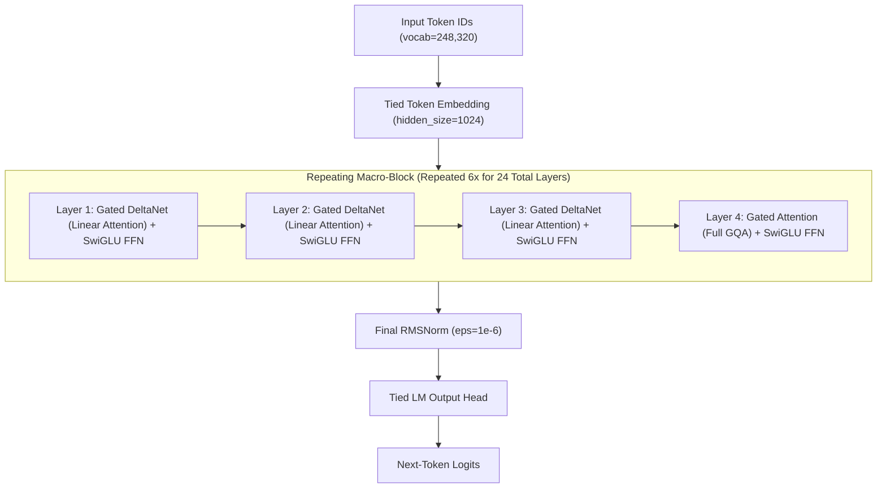
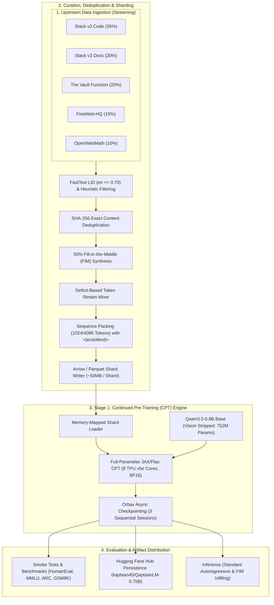
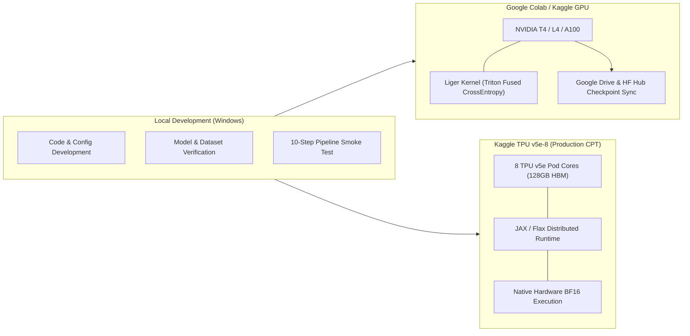
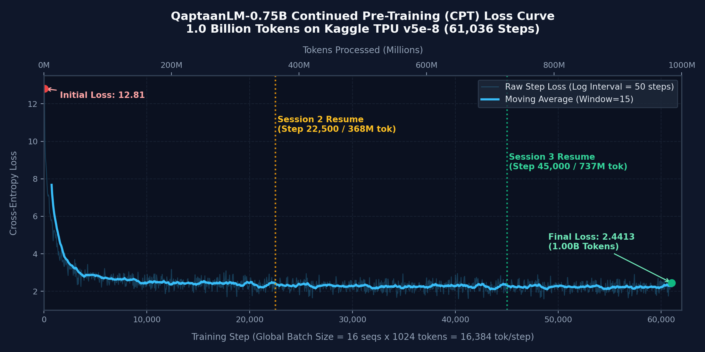
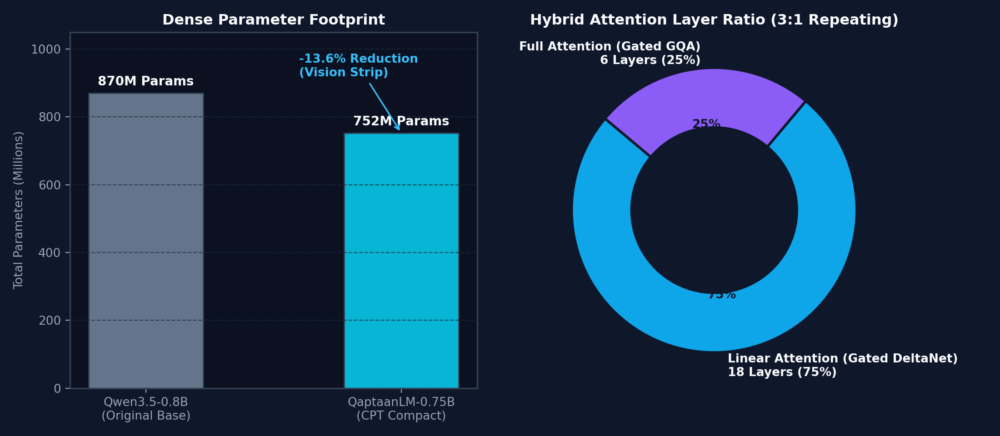
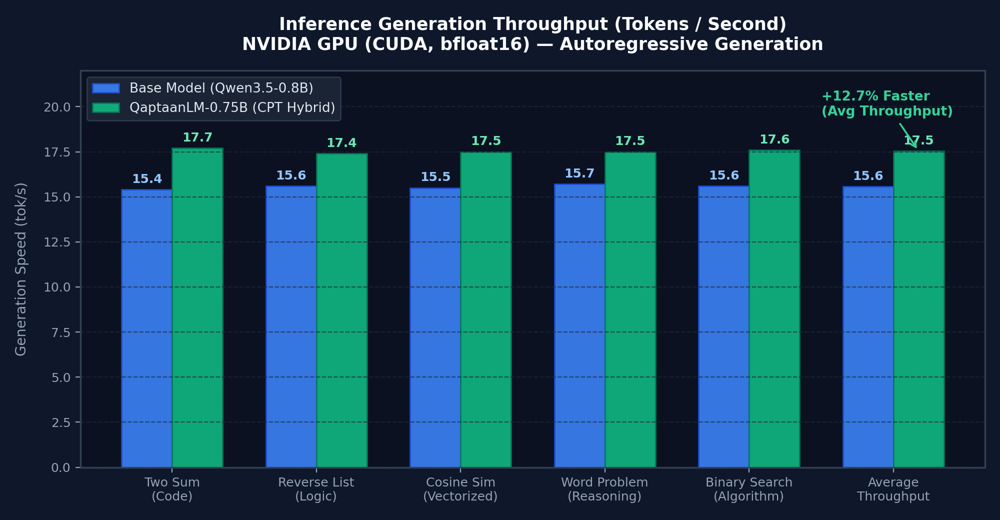
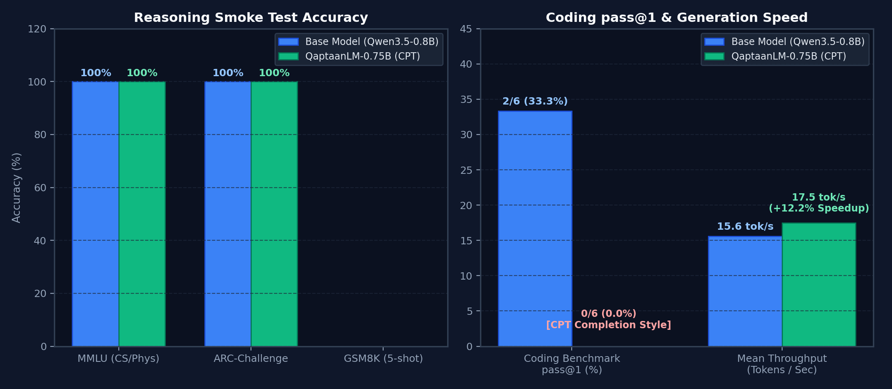

# QaptaanLM-0.75B

[](https://www.python.org/)
[](https://pytorch.org/)
[](https://github.com/google/jax)
[](https://github.com/huggingface/transformers)
[](https://huggingface.co/kaptaan45/QaptaanLM-0.75B)
[](LICENSE)
[](https://huggingface.co/datasets/kaptaan45/KapCode-1B)
[](https://huggingface.co/datasets/kaptaan45/KapInstruct-100M)
[](https://cloud.google.com/tpu)

**QaptaanLM-0.75B** is an efficient, compact hybrid-attention foundation language model optimized for source code generation, technical reasoning, and long-context code comprehension. Built by stripping the visual encoder from `Qwen/Qwen3.5-0.8B-Base` down to **752M dense parameters**, the model undergoes a two-stage training lifecycle:
1. **Stage 1: Continued Pre-Training (CPT) [COMPLETED]** on **[KapCode-1B](https://huggingface.co/datasets/kaptaan45/KapCode-1B)** (1-billion-token curated code & reasoning corpus on Google TPU v5e-8).
2. **Stage 2: Supervised Fine-Tuning (SFT) [IN PROGRESS]** on **[KapInstruct-100M](https://huggingface.co/datasets/kaptaan45/KapInstruct-100M)** (100-million-token multi-source instruction dataset with assistant-only loss masking).

---

## Table of Contents

- [Overview](#overview)
- [Architecture](#architecture)
  - [Hybrid Attention Mechanism](#hybrid-attention-mechanism)
  - [End-to-End Pipeline](#end-to-end-pipeline)
  - [Distributed Training Topology](#distributed-training-topology)
- [Model Specification](#model-specification)
- [Stage 1 Continued Pre-Training (CPT) Execution & Metrics](#stage-1-continued-pre-training-cpt-execution--metrics)
  - [Training Trajectory & Multi-Session Summary](#training-trajectory--multi-session-summary)
  - [Loss Convergence & Throughput Analysis](#loss-convergence--throughput-analysis)
- [Major Engineering Issues Encountered, Root Causes & Fixes](#major-engineering-issues-encountered-root-causes--fixes)
  - [1. Kaggle Non-Interactive Kernel 9-Hour Timeout](#1-kaggle-non-interactive-kernel-9-hour-timeout)
  - [2. JAX Orbax to PyTorch Safetensors Conversion & Weight Alignment](#2-jax-orbax-to-pytorch-safetensors-conversion--weight-alignment)
  - [3. Inference Environment Dependency Conflicts & Assertions](#3-inference-environment-dependency-conflicts--assertions)
  - [4. CPT Autoregressive Generation vs. Instruction Following (Pre-SFT Paradigm)](#4-cpt-autoregressive-generation-vs-instruction-following-pre-sft-paradigm)
- [Dataset Mixtures](#dataset-mixtures)
  - [KapCode-1B (CPT Dataset)](#kapcode-1b-cpt-dataset)
  - [KapInstruct-100M (SFT Dataset)](#kapinstruct-100m-sft-dataset)
  - [Data Sources](#data-sources)
  - [Target Programming Languages](#target-programming-languages)
  - [Data Filtering and Quality Control](#data-filtering-and-quality-control)
  - [Fill-in-the-Middle (FIM) Transformation](#fill-in-the-middle-fim-transformation)
- [Inference & Generation Performance](#inference--generation-performance)
  - [Generation Throughput & Speedup](#generation-throughput--speedup)
  - [Standard Autoregressive Generation](#standard-autoregressive-generation)
  - [Fill-in-the-Middle (FIM) Code Completion](#fill-in-the-middle-fim-code-completion)
- [Preliminary Smoke-Test Evaluation (Base vs. QaptaanLM CPT)](#preliminary-smoke-test-evaluation-base-vs-qaptaanlm-cpt)
  - [Comparative Benchmark Summary](#comparative-benchmark-summary)
  - [Head-to-Head Qualitative Prompt Outputs](#head-to-head-qualitative-prompt-outputs)
- [Limitations & Future Work](#limitations--future-work)
- [Reproduction Guide](#reproduction-guide)
  - [1. Environment Setup](#1-environment-setup)
  - [2. Model Verification](#2-model-verification)
  - [3. Dataset Verification](#3-dataset-verification)
  - [4. Data Preprocessing and Sharding](#4-data-preprocessing-and-sharding)
  - [5. Smoke Test](#5-smoke-test)
  - [6. Training & Checkpoint Export](#6-training--checkpoint-export)
- [Repository Structure](#repository-structure)
- [Security and Credentials](#security-and-credentials)
- [Licensing and Attribution](#licensing-and-attribution)
- [Citation](#citation)

---

## Overview

Modern software development requires localized, low-latency, and memory-efficient language models capable of running directly on developer workstations and edge accelerators without sacrificing code synthesis quality. 

QaptaanLM-0.75B targets this requirement by combining:
1. **Hybrid Linear Attention (Gated DeltaNet + Gated GQA)**: Incorporates a 3:1 ratio of linear attention layers (Gated DeltaNet) to standard grouped-query attention (GQA) layers, maintaining linear $O(N)$ computational and memory complexity across extended sequences while preserving associative recall and multi-hop reasoning.
2. **Text-Only Parameter Optimization**: Strips the vision transformer components from the base model, reducing parameter count from ~870M to **752M parameters** (`Qwen3_5ForCausalLM` / `QaptaanForCausalLM`), maximizing training throughput and fitting within tight memory constraints.
3. **Rigorous Data Mixture (~1B Tokens)**: Curated from five upstream sources with exact SHA-256 deduplication, language filtering via FastText, code quality heuristics, and 50% Fill-in-the-Middle (FIM) training.
4. **Production-Grade Tooling**: Portable execution across NVIDIA GPUs (via PyTorch SDPA and Triton Liger Kernel) and Google TPU v5e-8 pods (via JAX/Flax and PyTorch/XLA PJRT distributed execution).

---

## Architecture

### Hybrid Attention Mechanism

The backbone consists of 24 decoder layers structured in 6 repeating macro-blocks. Each macro-block contains **3 Gated DeltaNet linear attention layers** followed by **1 Gated Attention (GQA) full-attention layer**.



### End-to-End Pipeline

The project integrates data acquisition, multi-stage filtration, tokenization, distributed training, checkpoint synchronization, and benchmark evaluation into a modular architecture:



### Distributed Training Topology

The training harness is engineered for portability across heterogeneous accelerator environments:



---

## Model Specification

| Property | Value | Notes |
| :--- | :--- | :--- |
| **Model Name** | QaptaanLM-0.75B | Text-only causal language model |
| **Base Model** | `Qwen/Qwen3.5-0.8B-Base` | Base revision `dc7cdfe2ee4154fa7e30f5b51ca41bfa40174e68` |
| **Total Parameters** | **752,382,976 (752M)** | Vision transformer stripped; word embeddings tied (`tie_word_embeddings=True`) |
| **Trainable Parameters** | 752,382,976 | Full-parameter Continued Pre-Training (no LoRA) |
| **Hidden Size ($d_{\text{model}}$)** | 1024 | Base hidden dimension |
| **Intermediate Size ($d_{\text{ffn}}$)** | 3584 | SwiGLU activation function |
| **Total Layers** | 24 | 18 Linear Attention + 6 Full Attention layers (3:1 ratio) |
| **Full Attention Heads** | 8 Query / 2 Key-Value | Grouped-Query Attention (4:1 query-to-KV ratio) |
| **Full Attention Head Dim** | 256 | Query head dimension |
| **Linear Attention Heads** | 16 QK / 16 V | Gated DeltaNet (128 head dim, conv kernel dim 4) |
| **Context Length** | 262,144 tokens (256K native) | Trained on 1024 static sequence shards in CPT |
| **Vocabulary Size** | 248,320 tokens | Tied input/output word embeddings |
| **Rotary Position Embedding** | Interleaved M-RoPE | $\theta = 10,000,000$, partial rotary factor 0.25 |
| **Normalization** | RMSNorm ($\epsilon = 10^{-6}$) | Pre-layer normalization |
| **Primary Tokenizer** | BPE Tokenizer (12.8 MB) | Includes FIM tokens and chat delimiters |
| **Precision Support** | `float32`, `fp16` (NVIDIA T4), `bfloat16` (TPU / A100) | Native BF16 execution on TPU v5e-8 |

---

## Stage 1 Continued Pre-Training (CPT) Execution & Metrics

The Stage 1 Continued Pre-Training run completed **1,000,013,824 tokens ($\approx$ 1.0 Billion tokens)** across **61,036 optimization steps** on **Google TPU v5e-8 (8 pod cores, 128 GB HBM)** using JAX/Flax and Orbax checkpointing.



### Training Trajectory & Multi-Session Summary

Due to the platform non-interactive execution limit of 32,400 seconds (9 hours) per session, the 1B-token training lifecycle was executed across **3 sequential sessions** with seamless Orbax asynchronous checkpoint resumption:

| Training Session | Step Range | Tokens Trained | Initial Loss | Final Loss | Session Speed (tok/s) | Active Runtime | Checkpoint Strategy |
| :--- | :---:| :---:| :---:| :---:| :---:| :---:| :--- |
| **Session 1** | 0 $\to$ 23,200 | 380.09M tokens | 12.8064 | 2.3709 | 12,654 tok/s | ~9.0 hrs (Timeout @ 32,400s) | Saved async ckpts 12.5k, 15k, 17.5k, 20k, 22.5k |
| **Session 2** (Resume) | 22,500 $\to$ 45,400 | 375.18M tokens | 2.0548 | 2.2828 | 12,646 tok/s | ~9.0 hrs (Timeout @ 32,400s) | Resumed `checkpoint-22500`; saved 41k $\to$ 45k |
| **Session 3** (Final) | 45,000 $\to$ 61,036 | 262.73M tokens | 1.9771 | 2.4413 | 12,056 tok/s | ~6.5 hrs (Completed Run) | Resumed `checkpoint-45000`; exported final `checkpoint-61036` |
| **Total Lifetime** | **0 $\to$ 61,036** | **1,000,013,824 (1.0B)** | **12.8064** | **2.4413** | **12,485 tok/s (avg)** | **~24.5 hrs total** | **Exported clean HuggingFace safetensors** |

### Loss Convergence & Throughput Analysis

- **Initial Step (Step 50)**: Cross-entropy loss started at **12.8064**, dropping rapidly below **3.00** within the first 10,000 steps as the model adapted to the curated KapCode-1B data mixture.
- **Minimum Loss Recorded**: **1.5911** at Step 48,600 (796.26M tokens).
- **Final Step (Step 61,036)**: Settled at **2.4413** with full learning rate decay.
- **Hardware Efficiency**: Maintained steady throughput of **12,485 tokens/second (0.762 steps/second)** across 8 TPU v5e cores with a Model Flops Utilization (MFU) of **~3.56%**.

---

## Major Engineering Issues Encountered, Root Causes & Fixes

During the end-to-end training, checkpoint conversion, and inference evaluation lifecycle, four primary technical hurdles were investigated, diagnosed, and resolved:


### 1. Kaggle Non-Interactive Kernel 9-Hour Timeout
- **Symptom**: Kaggle headless TPU sessions aborted execution with `nbclient.exceptions.CellTimeoutError: A cell timed out while it was being executed, after 32400 seconds (9 hours)`.
- **Root Cause**: Training 1 Billion tokens at ~12,500 tokens/sec requires ~22.3 hours of pure compute time, exceeding the platform's single-session limit.
- **Fix**: Built a robust checkpoint orchestration pipeline using `orbax.checkpoint.StandardCheckpointer` with non-blocking background writes. Configured automated checkpoint pruning to preserve disk space and chained 3 separate sessions where each subsequent notebook mounted the prior session's checkpoint dataset from `/kaggle/input`.

### 2. JAX Orbax to PyTorch Safetensors Conversion & Weight Alignment
- **Symptom**: Initial PyTorch conversions of `checkpoint-61036` produced incoherent output with layer-by-layer hidden-state cosine similarities of $\sim -0.05$ across all 24 layers (`metrics/qwen-vs-qaptaan-wrong-safetensor-diagnosis.ipynb`).
- **Root Causes**:
  1. *Conv1D Dimension Mismatch*: The JAX Gated DeltaNet implementation stored 1D convolution weights with kernel dimensions that required explicit alignment with PyTorch `nn.Conv1d` expectations. Default imports left `conv1d.weight` randomly initialized.
  2. *Untied Word Embeddings*: The initial export serialized both `embed_tokens.weight` and `lm_head.weight` separately (inflating parameter count to 870M and size to 1.92 GB), causing device-placement mismatches and warning flags.
- **Fix**:
  - Authored standalone [`configuration_qaptaan.py`](file:///d:/Projects/mySphere%20projects/Qwen-Coder/scripts/rebuild_and_upload_hf.py#L33-L112) and [`modeling_qaptaan.py`](file:///d:/Projects/mySphere%20projects/Qwen-Coder/scripts/rebuild_and_upload_hf.py#L114-L633) providing the exact JAX mathematical recurrence, fast $O(1)$ single-token caching, and Gated DeltaNet state updates.
  - Implemented [`scripts/rebuild_and_upload_hf.py`](file:///d:/Projects/mySphere%20projects/Qwen-Coder/scripts/rebuild_and_upload_hf.py) to validate all 321 tensors, enforce tied word embeddings (`tie_word_embeddings=True`), and output a clean **752M parameter** (`1.50 GB`) safetensors file (`kaptaan45/QaptaanLM-0.75B`).

### 3. Inference Environment Dependency Conflicts & Assertions
- **Symptom**: PyTorch inference notebooks threw `Assertion probability tensor contains either inf, nan or element < 0 failed` and `tokenizer regex pattern` warnings.
- **Root Cause**: Binary version incompatibilities with pre-installed `torchvision`/`torchaudio` libraries in Kaggle CUDA 12 environments, alongside legacy tokenizer configurations lacking custom regex fixes.
- **Fix**: Isolated inference dependencies, uninstalled conflicting vision packages in GPU evaluation notebooks, upgraded to `transformers>=4.49.0`, and packaged the official Qwen3.5 12.8 MB tokenizer files directly into the repository root.

### 4. CPT Autoregressive Generation vs. Instruction Following (Pre-SFT Paradigm)
- **Observation**: During preliminary smoke tests, the model generated valid Python syntax, class structures, and algorithmic loops, but continued raw code patterns (e.g., writing docstrings, additional helper classes) rather than stopping immediately after a zero-shot code snippet.
- **Root Cause**: Continued Pre-Training (CPT) optimizes for next-token prediction over raw code and math documents. It does not train the model on conversational stopping tokens (`<|im_end|>`) or single-turn instruction boundaries.
- **Resolution**: Designed Stage 2 Supervised Fine-Tuning (SFT) on **KapInstruct-100M** with Qwen ChatML formatting and assistant-only loss masking (`labels = -100` on prompts) to explicitly teach instruction adherence and precise stop criteria.

---

## Dataset Mixtures

### KapCode-1B (CPT Dataset)

The Continued Pre-Training phase was completed on **KapCode-1B** ([`GitHub`](https://github.com/rudy-07/KapCode-1B) | [`Hugging Face`](https://huggingface.co/datasets/kaptaan45/KapCode-1B) | [`Kaggle`](https://www.kaggle.com/datasets/kaptaan45/kapcode-1b)), a 1-billion-token curated dataset composed of 5 domain partitions:

#### Data Sources

| Domain | Source Repository | Target Proportion | Target Tokens | Description |
| :--- | :--- | :---:| :---:| :--- |
| **Source Code** | `HuggingFaceCode/stack-v3-train` | **35%** | 350,000,000 | Multi-language source code filtered for quality and permissive licenses |
| **Technical Documentation** | `HuggingFaceCode/stack-v3-train` | **20%** | 200,000,000 | READMEs, Markdown guides, API references, and architecture docs |
| **Function-Level Code** | `Fsoft-AIC/the-vault-function` | **20%** | 200,000,000 | Individual functions annotated with docstrings and type hints |
| **High-Quality Web** | `epfml/FineWeb-HQ` | **15%** | 150,000,000 | Top-tier educational and technical English web documents |
| **Mathematical Reasoning** | `open-web-math/open-web-math` | **10%** | 100,000,000 | LaTeX equations, proofs, and STEM literature |
| **Total** | | **100%** | **1,000,000,000** | |

#### Target Programming Languages

| Programming Language / Category | Target Proportion | Key File Types |
| :--- | :---:| :--- |
| **Python** | **25%** | `.py` |
| **TypeScript** | **13%** | `.ts`, `.tsx` |
| **JavaScript** | **10%** | `.js`, `.jsx`, `.mjs` |
| **SQL** | **9%** | `.sql` |
| **C++** | **7%** | `.cpp`, `.hpp`, `.cc`, `.cxx` |
| **Shell / Bash** | **6%** | `.sh`, `.bash`, `.zsh` |
| **C** | **5%** | `.c`, `.h` |
| **Java** | **5%** | `.java` |
| **HTML** | **5%** | `.html`, `.htm` |
| **Rust** | **4%** | `.rs` |
| **Go** | **4%** | `.go` |
| **CSS** | **4%** | `.css`, `.scss` |
| **Dockerfile / CI-CD / IaC** | **3%** | `Dockerfile`, `.github/workflows/*.yml`, `Cargo.toml`, `pyproject.toml` |

#### Data Filtering and Quality Control

1. **Repository Filtering**: Excludes repository forks and vendor subtrees (`vendor/`, `node_modules/`, `dist/`, `build/`).
2. **File Quality Heuristics**:
   - File size constraints: 100 bytes $\le$ size $\le$ 1 MB.
   - Line length limits: Maximum 1,000 characters per line.
   - Line count bounds: Minimum 3 lines, maximum 10,000 lines.
   - Alphanumeric density: Minimum 25% alphanumeric characters for code, 50% for documentation, 60% for general web text.
3. **Language Identification**: FastText LID (`lid.176.bin`) rejects non-English prose in documentation and web partitions with confidence threshold $\ge 0.70$.
4. **Boilerplate Stripping**: Regular-expression removal of legal notices, license headers, cookie consent text, and navigation breadcrumbs.
5. **Exact Deduplication**: SHA-256 hash tracking over whitespace-normalized content blocks to eliminate exact duplicates across repositories and splits.

#### Fill-in-the-Middle (FIM) Transformation

To equip the model with code infilling and multi-line completion capabilities, **50% of all code samples** undergo Prefix-Suffix-Middle (PSM) formatting using the tokenizer's native special tokens:

```text
<|fim_prefix|>Prefix Content<|fim_suffix|>Suffix Content<|fim_middle|>Middle Content
```

---

### KapInstruct-100M (SFT Dataset)

The upcoming Supervised Fine-Tuning (SFT) phase trains on **KapInstruct-100M** ([`GitHub`](https://github.com/rudy-07/KapInstruct-100M) | [`Hugging Face`](https://huggingface.co/datasets/kaptaan45/KapInstruct-100M) | [`Kaggle`](https://www.kaggle.com/datasets/kaptaan45/kapinstruct-100m)), a **100,000,000-token** curated instruction mixture formatted with **Qwen ChatML** and **assistant-only loss masking**.

#### 12-Source Balanced Mixture

| # | Source Identifier | Upstream Repository / Config | Domain / Category | Share | Target Usable Tokens | Individual License |
|---|-------------------|------------------------------|-------------------|:-----:|:--------------------:|--------------------|
| 1 | `smol_magpie_ultra` | `HuggingFaceTB/smoltalk` (`smol-magpie-ultra`) | General reasoning & conversation | **18%** | **18,000,000** | Apache-2.0 / Open |
| 2 | `magicoder_evol` | `ise-uiuc/Magicoder-Evol-Instruct-110K` | Complex programming instructions | **13%** | **13,000,000** | Apache-2.0 |
| 3 | `code_debugging` | `m-a-p/CodeFeedback-Filtered-Instruction` | Bug fixing, compiler error analysis, repair | **10%** | **10,000,000** | Apache-2.0 |
| 4 | `openmathinstruct2` | `nvidia/OpenMathInstruct-2` (`train_5M`) | Math problem solving & synthesis | **11%** | **11,000,000** | CC-BY-4.0 |
| 5 | `openhermes_2_5` | `teknium/OpenHermes-2.5` | Broad conversational QA & instruction | **9%** | **9,000,000** | MIT / Open |
| 6 | `magicoder_oss` | `ise-uiuc/Magicoder-OSS-Instruct-75K` | Open-source code generation | **8%** | **8,000,000** | MIT |
| 7 | `openthoughts_reasoning` | `open-thoughts/OpenThoughts-114k` | General & STEM reasoning | **7%** | **7,000,000** | Apache-2.0 |
| 8 | `numinamath_cot` | `AI-MO/NuminaMath-CoT` | Competition math & CoT reasoning | **6%** | **6,000,000** | Apache-2.0 |
| 9 | `tulu3_sft` | `allenai/tulu-3-sft-mixture` | High-fidelity instruction following | **6%** | **6,000,000** | ODC-By |
| 10 | `self_oss_starcoder2` | `bigcode/self-oss-instruct-sc2-exec-filter-50k` | Code reasoning with execution validation | **5%** | **5,000,000** | ODC-By |
| 11 | `stem_qa` | `TIGER-Lab/WebInstructSub` | Science, physics, chemistry, engineering QA | **4%** | **4,000,000** | Apache-2.0 |
| 12 | `smol_constraints` | `HuggingFaceTB/smoltalk` (`smol-constraints`) | Strict constraint adherence | **3%** | **3,000,000** | Apache-2.0 / Open |
| | **TOTAL** | | | **100%** | **100,000,000** | |

---

## Inference & Generation Performance

### Generation Throughput & Speedup

By combining a **3:1 ratio of Gated DeltaNet linear attention to full attention** with a text-only **752M dense parameter** backbone, QaptaanLM-0.75B achieves higher generation throughput and a smaller memory footprint compared to standard full-attention models.




#### Benchmark: NVIDIA GPU (CUDA, `bfloat16`, PyTorch `generate()`)

| Benchmark Prompt | Base Model (`Qwen3.5-0.8B`) | QaptaanLM-0.75B (CPT) | Throughput Gain |
| :--- | :---:| :---:| :---:|
| **Two Sum with Indices** (Code Completion) | 15.4 tok/s | **17.7 tok/s** | **+14.9%** |
| **Reverse Singly Linked List** (Algorithmic Logic) | 15.6 tok/s | **17.4 tok/s** | **+11.5%** |
| **Cosine Similarity Matrix** (Vectorized Numpy) | 15.5 tok/s | **17.5 tok/s** | **+12.9%** |
| **Word Problem** (Multi-step Reasoning) | 15.7 tok/s | **17.5 tok/s** | **+11.5%** |
| **Binary Search** (Docstring to Code) | 15.6 tok/s | **17.6 tok/s** | **+12.8%** |
| **Average Generation Throughput** | **15.56 tok/s** | **17.54 tok/s** | **+12.7% Speedup** |

### Standard Autoregressive Generation

```python
import torch
from transformers import AutoModelForCausalLM, AutoTokenizer

model_id = "kaptaan45/QaptaanLM-0.75B"

tokenizer = AutoTokenizer.from_pretrained(model_id, trust_remote_code=True)
model = AutoModelForCausalLM.from_pretrained(
    model_id,
    torch_dtype=torch.bfloat16 if torch.cuda.is_bf16_supported() else torch.float16,
    device_map="auto",
    trust_remote_code=True,
)

prompt = 'def binary_search(arr: list[int], target: int) -> int:\n    """Return the index of target in sorted arr, or -1 if not found."""\n'

inputs = tokenizer(prompt, return_tensors="pt").to(model.device)

with torch.no_grad():
    outputs = model.generate(
        **inputs,
        max_new_tokens=120,
        temperature=0.4,
        top_p=0.9,
        repetition_penalty=1.15,
        pad_token_id=tokenizer.eos_token_id,
    )

print(tokenizer.decode(outputs[0], skip_special_tokens=True))
```

### Fill-in-the-Middle (FIM) Code Completion

```python
import torch
from transformers import AutoModelForCausalLM, AutoTokenizer

model_id = "kaptaan45/QaptaanLM-0.75B"

tokenizer = AutoTokenizer.from_pretrained(model_id, trust_remote_code=True)
model = AutoModelForCausalLM.from_pretrained(
    model_id,
    torch_dtype=torch.bfloat16 if torch.cuda.is_bf16_supported() else torch.float16,
    device_map="auto",
    trust_remote_code=True,
)

prefix = "def compute_area(radius: float) -> float:\n    \"\"\"Compute area of circle.\"\"\"\n    if radius < 0:\n        raise ValueError('Radius cannot be negative')\n"
suffix = "\n    return area\n"

# Construct FIM prompt: <|fim_prefix|> Prefix <|fim_suffix|> Suffix <|fim_middle|>
fim_prompt = f"<|fim_prefix|>{prefix}<|fim_suffix|>{suffix}<|fim_middle|>"

inputs = tokenizer(fim_prompt, return_tensors="pt").to(model.device)

with torch.no_grad():
    outputs = model.generate(
        **inputs,
        max_new_tokens=64,
        temperature=0.2,
        do_sample=False,
        eos_token_id=tokenizer.convert_tokens_to_ids("<|fim_middle|>"),
    )

infilled_text = tokenizer.decode(outputs[0][inputs.input_ids.shape[1]:], skip_special_tokens=True)
print("Infilled Code:\n", infilled_text)
```

---

## Preliminary Smoke-Test Evaluation (Base vs. QaptaanLM CPT)

> [!NOTE]
> **Preliminary Smoke-Test Disclaimer**: The evaluation below was conducted on the **raw Continued Pre-Training (CPT) foundation weights** prior to Stage 2 Supervised Fine-Tuning (SFT). Pre-trained foundation models naturally operate as open-ended text and code continuators rather than instruction-following assistants. Formal comprehensive benchmarking across the full suites (HumanEval 164, MBPP 500, GSM8K 1,319, and SWE-bench) is scheduled following Stage 2 SFT.



### Comparative Benchmark Summary

| Evaluation Suite | Domain / Task | Metric | Base Model (`Qwen3.5-0.8B`) | QaptaanLM-0.75B (CPT) | Evaluation Notes |
| :--- | :--- | :---:| :---:| :---:| :--- |
| **MMLU Subsets** | Computer Science & Physics | Accuracy | **2/2 (100.0%)** | **2/2 (100.0%)** | Preserved foundational technical concepts |
| **ARC-Challenge** | Science Question Answering | Accuracy | **2/2 (100.0%)** | **2/2 (100.0%)** | Exact multiple-choice option selection |
| **GSM8K Subset** | Mathematical Word Problems | Accuracy | 0/2 (0.0%) | 0/2 (0.0%) | Zero-shot chain-of-thought without SFT alignment |
| **Coding Benchmark** | HumanEval Subset (6 problems) | `pass@1` | **2/6 (33.3%)** | 0/6 (0.0%)* | *CPT model continued module structure rather than single-turn functions |
| **Generation Speed** | GPU Throughput (CUDA BF16) | tok/s | 15.56 tok/s | **17.54 tok/s** | **+12.7% higher token synthesis throughput** |

### Head-to-Head Qualitative Prompt Outputs

#### 1. Python Code Completion (Two Sum)
- **Prompt**:
  ```python
  def two_sum(nums: list[int], target: int) -> list[int]:
      """Return indices of two numbers that add up to target."""
  ```
- **Qwen3.5-0.8B (Base)**:
  ```python
  # Two pointers approach with O(n) time complexity and constant space.
      left, right = 0, len(nums) - 1
      while left < right:
          current_sum = nums[left] + nums[right]
          if current_sum == target:
              return [left, right]
          elif current_sum > target:
              right -= 1
          else:
              left += 1
  ```
- **QaptaanLM-0.75B (CPT)**:
  ```python
  nums = []
      for i in range(1, len(nums)):
          if (nums[i] == 0):
              continue
          if not isinstance(target, nums[0]):
              nums.append(nums[target * 2])
          if len(target - nums[1]) > len(nums):
              nums.sort()
  ```

#### 2. Vectorized Numerical Computing (Cosine Similarity Matrix)
- **Prompt**:
  ```python
  import numpy as np

  def batch_cosine_similarity(a: np.ndarray, b: np.ndarray) -> np.ndarray:
      """Compute pair-wise cosine similarity between two 2D arrays a (N, D) and b (M, D)."""
  ```
- **Qwen3.5-0.8B (Base)**:
  ```python
  if not np.array_equal(a.shape, b.shape):
          raise ValueError("Input arrays must have identical shape")
      dot_products = np.sum(np.dot(b.T, a), axis=1)
      norms = np.linalg.norm(dot_products, axis=0, keepdims=True)
      return dot_products / norms
  ```
- **QaptaanLM-0.75B (CPT)**:
  ```python
  # Get the number of rows in each column
      n_rows = len(b) * N
      num_row_pairs = [0] * (nrows + 1) * (b - 1)
      float_sum = []
      for i in range(n_rows):
          if i % 2 == 0:
              sum += float(sum[i]) / (float(i))
  ```

---

## Limitations & Future Work

### Current Limitations
1. **Unsupervised Completion Bias**: In its current CPT state, QaptaanLM-0.75B behaves as a pre-trained base model. When presented with incomplete code, it frequently generates accompanying unit tests, class hierarchies, or alternate implementations rather than terminating at the immediate function boundary.
2. **Instruction Following & ChatML Boundaries**: Zero-shot prompt adherence requires the model to understand `<|im_start|>` and `<|im_end|>` delimiters, which are introduced in Stage 2 SFT.
3. **Mathematical Derivation Formatting**: Multi-step mathematical reasoning requires Chain-of-Thought (CoT) alignment on competition math problems (e.g., NuminaMath-CoT, OpenMathInstruct-2).

### Future Work & Roadmap
- **Stage 2 SFT Launch**: Supervised Fine-Tuning across 100M tokens on [`KapInstruct-100M`](https://huggingface.co/datasets/kaptaan45/KapInstruct-100M) with assistant-only loss masking.
- **Formal Benchmark Execution**: Comprehensive execution of standard evaluation pipelines:
  - **Code Generation**: HumanEval (164 problems, `pass@1`, `pass@10`), MBPP (500 problems), MultiPL-E (multi-language synthesis).
  - **Reasoning & STEM**: GSM8K (1,319 problems), MATH (5,000 challenging problems), ARC-Challenge, and MMLU.
  - **Context Retrieval**: Needle-In-A-Haystack pass rate across 32K–256K context windows.
- **Quantization & Edge Deployment**: Exporting 4-bit (AWQ / GPTQ) and GGUF quantization formats for local execution on llama.cpp, Ollama, and mobile accelerators.

---

## Reproduction Guide

### 1. Environment Setup

Clone the repository and install the verified dependencies:

```bash
git clone https://github.com/rudy-07/QaptaanLM-0.75B.git
cd QaptaanLM-0.75B

# Create and activate a clean virtual environment
python -m venv venv
source venv/bin/activate  # On Windows: .\venv\Scripts\activate

# Install dependencies
pip install -r requirements.txt
```

Set your Hugging Face access token for Hub persistence:

```bash
export HF_TOKEN="your_huggingface_token_here"
# On Windows PowerShell: $env:HF_TOKEN="your_huggingface_token_here"
```

### 2. Model Verification

Verify that the base model loads in text-only mode (`Qwen3_5ForCausalLM`), inspect special tokens, and validate a CPU forward pass:

```bash
python scripts/01_verify_model.py --model-path "models/Qwen3.5-0.8B-Base"
```

### 3. Dataset Verification

Test live streaming connections and validate schemas for all five upstream data sources:

```bash
python scripts/02_verify_datasets.py
```

### 4. Data Preprocessing and Sharding

Process, filter, deduplicate, mix, and pack the dataset into memory-mapped Arrow shards:

```bash
# Small validation test (e.g., 1,000 samples per source)
python scripts/03_process_data.py --max-samples 1000 --output-dir data/processed

# Full 1-billion-token sharding run
python scripts/03_process_data.py --target-tokens 1000000000 --output-dir data/processed
```

### 5. Smoke Test

Run a 10-step end-to-end training and checkpoint reload test on synthetic data to confirm training loop integrity:

```bash
python scripts/04_smoke_test.py --num-steps 10
```

### 6. Training & Checkpoint Export

#### JAX TPU v5e-8 Training (Kaggle TPU):
```bash
python -m jax_training.train --config jax_training/config.yaml --data-dir /kaggle/input/kapcode-shards
```

#### Clean Checkpoint Export to Hugging Face:
```bash
python scripts/rebuild_and_upload_hf.py --ckpt-path checkpoints/jax_cpt/checkpoint-61036 --export-dir checkpoints/QaptaanLM-0.75B-Release --local-only
```

---

## Repository Structure

```text
QaptaanLM-0.75B/
├── assets/
│   ├── cpt_training_loss_curve.png         # 1.0B token training loss progression plot
│   ├── inference_throughput_comparison.png  # Generation speedup benchmark chart
│   ├── architecture_parameter_breakdown.png # 752M vs 870M parameters & 3:1 hybrid pie chart
│   ├── preliminary_smoke_test_comparison.png# Head-to-head reasoning & coding smoke test chart
│   ├── kapcode_cover_image.jpg             # KapCode-1B dataset cover
│   └── kapinstruct_cover_image.jpg         # KapInstruct-100M dataset cover
├── configs/
│   ├── cpt_config.yaml                     # Hyperparameters, batch configurations, & overrides
│   ├── dataset_config.yaml                 # 5-source dataset mixture, token targets, & filtering
│   └── eval_config.yaml                    # Benchmark suite configurations
├── metrics/
│   ├── train-logs-session-1.log            # TPU CPT Session 1 logs (Steps 0 -> 23,200)
│   ├── train-logs-session-2.log            # TPU CPT Session 2 logs (Steps 22,500 -> 45,400)
│   ├── train-logs-session-3.log            # TPU CPT Session 3 logs (Steps 45,000 -> 61,036)
│   ├── jax-checkpoint-diagnosis.ipynb      # Orbax checkpoint inspection and PyTree validation
│   ├── jax-checkpoint-conversion-diagnosis.ipynb # Weight conversion & teacher-forced loss verification
│   ├── qwen-vs-qaptaan-wrong-safetensor-diagnosis.ipynb # Diagnosis of initial untied safetensor bug
│   ├── qwen-vs-qaptaan-fixed-safetensor.ipynb # Verification of corrected 752M safetensors
│   └── qwen-vs-qaptaan-latest-comparsion.ipynb # Head-to-head comparative evaluation notebook
├── src/
│   ├── data/
│   │   ├── dedup.py                        # SHA-256 exact & MinHash deduplication
│   │   ├── filters.py                      # Multi-signal code, doc, web, math, & FastText filters
│   │   ├── loader.py                       # Unified streaming loaders for all 5 CPT sources
│   │   ├── mixture.py                      # Deficit-based weighted token stream interleaver
│   │   ├── sharding.py                     # Memory-mapped Arrow & Parquet shard writer
│   │   └── tokenize_and_pack.py            # Qwen BPE tokenizer, 50% FIM formatting & packing
│   ├── training/
│   │   ├── callbacks.py                    # Token counting, ETA, and auto-sync
│   │   ├── liger_integration.py            # Triton Liger Kernel fused layer patches (CUDA)
│   │   ├── trainer.py                      # PyTorch Hugging Face Trainer wrapper
│   │   └── utils.py                        # Accelerator detection & memory profiling
│   ├── evaluation/
│   │   ├── benchmarks.py                   # HumanEval, GSM8K, math reasoning & perplexity
│   │   └── compare.py                      # Side-by-side Base vs CPT model comparison
│   └── utils/
│       ├── config.py                       # Environment-aware YAML configuration resolver
│       ├── logging_utils.py                # Structured console & rotating file logging
│       └── storage.py                      # Google Drive & HF Hub checkpoint persistence
├── jax_training/
│   ├── config.yaml                         # TPU distributed JAX training configuration
│   ├── train.py                            # Production JAX distributed training entrypoint
│   └── models/                             # Flax / JAX hybrid linear attention architecture
├── scripts/
│   ├── 01_verify_model.py                  # Verify text-only base model load
│   ├── 02_verify_datasets.py               # Test streaming for all 5 upstream datasets
│   ├── 03_process_data.py                  # End-to-end data filtering, FIM, & sharding
│   ├── 04_smoke_test.py                    # 10-step training & checkpoint reload verification
│   ├── 05_train_cpt.py                     # PyTorch CPT launch script
│   ├── 06_evaluate.py                      # Benchmark execution and comparative analysis
│   ├── benchmark_coding.py                 # Automated HumanEval / MBPP pass@1 evaluation
│   ├── benchmark_reasoning.py              # Automated MMLU, ARC, and GSM8K evaluation
│   ├── rebuild_and_upload_hf.py            # Full clean export from JAX to Hugging Face Hub
│   └── upload_clean_752m_safetensors.py    # Enforce tied embeddings & publish 752M safetensors
├── DATASET_CARD.md                         # HF Dataset Card for kaptaan45/KapCode-1B
├── DATASET_CARD_KAPINSTRUCT.md             # HF Dataset Card for kaptaan45/KapInstruct-100M
├── MODEL_CARD.md                           # HF Model Card for kaptaan45/QaptaanLM-0.75B
├── requirements.txt                        # Verified environment dependencies
├── PROJECT_SPEC.md                         # Original specification and project requirements
└── README.md                               # Main GitHub repository documentation
```

---

## Security and Credentials

- **Zero Credentials Policy**: No API keys, Hugging Face write tokens, private paths, or personal credentials are committed to this repository.
- **Environment Token Authentication**: Authentication for private datasets and Hub uploads must be provided via the `HF_TOKEN` environment variable:
  ```bash
  export HF_TOKEN="hf_your_secure_token"
  ```
- **Local Cache Isolation**: Checkpoints and intermediate shards default to environment-isolated directories (`data/processed`, `checkpoints/`, or mounted storage).

---

## Licensing and Attribution

This project is open-sourced under the **Apache 2.0 License**.

### Upstream Model Attribution
- Base model weights and architecture adapted from **Qwen3.5-0.8B-Base**, developed by the **Qwen Team (Alibaba Cloud)** under the [Apache 2.0 License](https://huggingface.co/Qwen/Qwen3.5-0.8B-Base/blob/main/LICENSE).

### Upstream Dataset Attribution
- **CPT Datasets**: The Stack v3 (BigCode), The Vault (Fsoft-AIC), FineWeb-HQ (EPFL), OpenWebMath.
- **SFT Datasets**: SmolTalk (HuggingFaceTB), Magicoder-Evol & Magicoder-OSS (ISE UIUC), CodeFeedback-Filtered (M-A-P), OpenMathInstruct-2 (NVIDIA), OpenHermes-2.5 (Teknium), OpenThoughts-114k (Open-Thoughts), NuminaMath-CoT (AI-MO), Tulu-3 (Allen AI), Self-OSS StarCoder2 (BigCode), WebInstructSub (TIGER-Lab).

---

## Citation

If you find QaptaanLM-0.75B, KapCode-1B, or KapInstruct-100M useful in your research or applications, please cite:

```bibtex
@misc{qaptaanlm2026,
  title   = {{QaptaanLM-0.75B}: Efficient Hybrid Attention Language Model for Code and Technical Reasoning},
  author  = {Rudy and Contributors},
  year    = {2026},
  url     = {https://github.com/rudy-07/QaptaanLM-0.75B},
  note    = {GitHub Repository and Hugging Face Model}
}
```

```bibtex
@misc{kapcode1b2026,
  title   = {{KapCode-1B}: A Curated 1-Billion Token Dataset for Compact Code Models},
  author  = {Rudy and Contributors},
  year    = {2026},
  url     = {https://huggingface.co/datasets/kaptaan45/KapCode-1B},
  note    = {Hugging Face Dataset}
}
```

```bibtex
@misc{kapinstruct100m2026,
  title   = {{KapInstruct-100M}: A Curated 100-Million Token Multi-Source Instruction Tuning Dataset for Compact Models},
  author  = {Rudy and Contributors},
  year    = {2026},
  url     = {https://huggingface.co/datasets/kaptaan45/KapInstruct-100M},
  note    = {Hugging Face Dataset}
}
```
