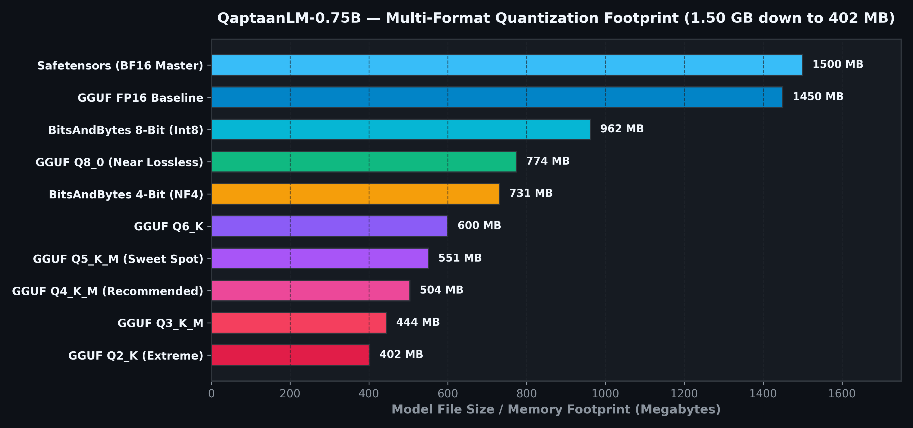
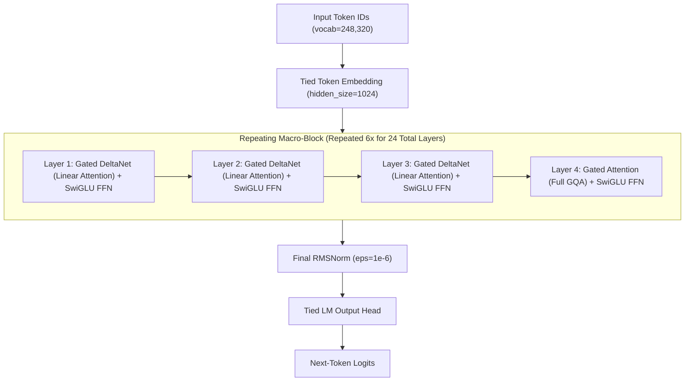
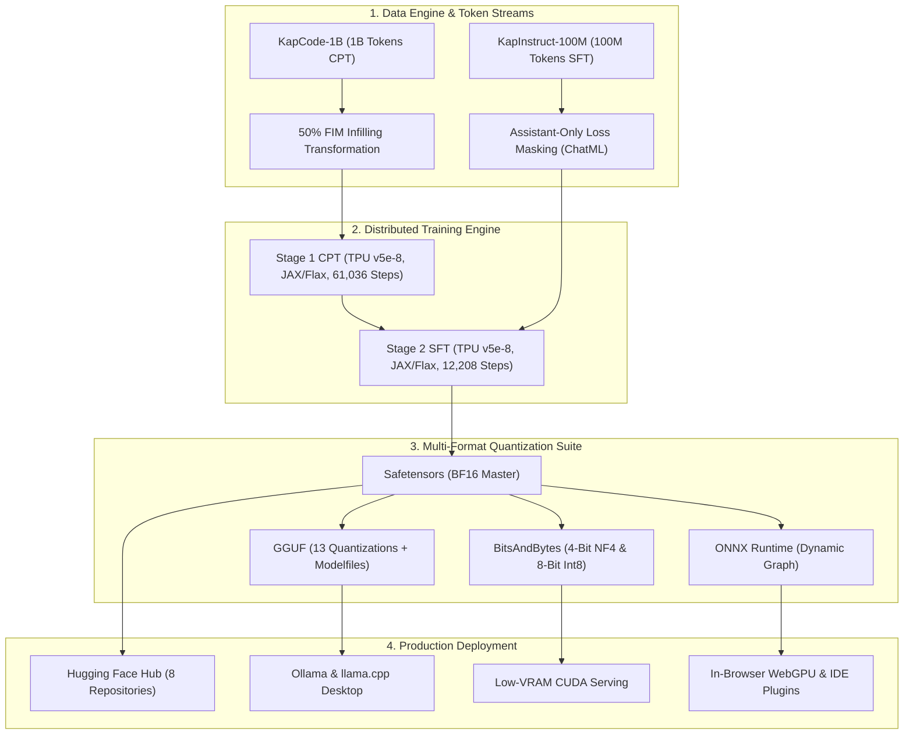
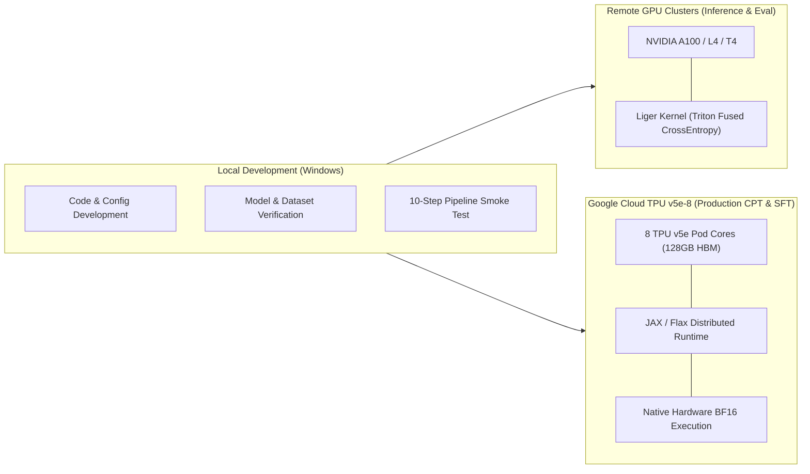
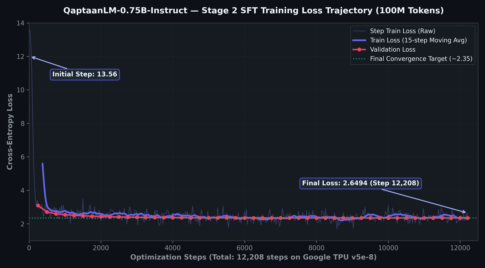
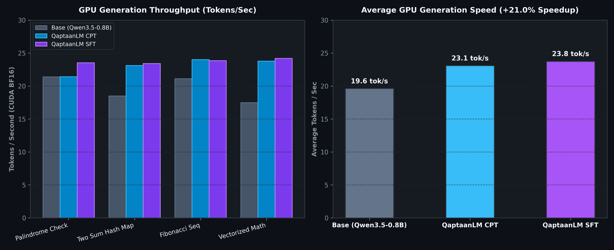
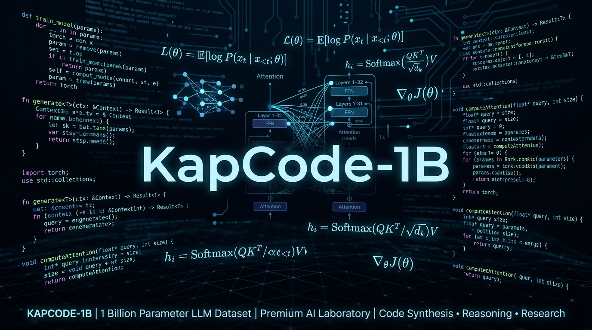
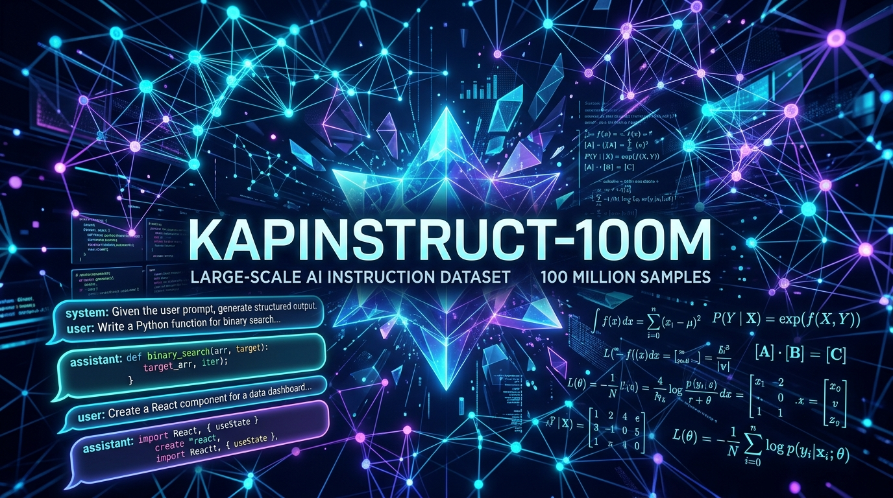

# QaptaanLM-0.75B

[](https://www.python.org/)
[](https://pytorch.org/)
[](https://github.com/google/jax)
[](https://github.com/huggingface/transformers)
[](https://huggingface.co/kaptaan45/QaptaanLM-0.75B)
[](https://huggingface.co/kaptaan45/QaptaanLM-0.75B-Instruct)
[](LICENSE)
[](https://huggingface.co/datasets/kaptaan45/KapCode-1B)
[](https://huggingface.co/datasets/kaptaan45/KapInstruct-100M)
[](https://cloud.google.com/tpu)

**QaptaanLM-0.75B** is a compact, high-efficiency hybrid-attention foundation language model optimized for source code generation, technical reasoning, and long-context code comprehension. Built by stripping the visual encoder from `Qwen/Qwen3.5-0.8B-Base` down to **752M dense parameters**, the model undergoes a two-stage training lifecycle:

1. **Stage 1: Continued Pre-Training (CPT) [COMPLETED]** on **[KapCode-1B](https://huggingface.co/datasets/kaptaan45/KapCode-1B)** (1-billion-token curated code & reasoning corpus on Google TPU v5e-8 with 50% Fill-in-the-Middle infilling).
2. **Stage 2: Supervised Fine-Tuning (SFT) [COMPLETED]** on **[KapInstruct-100M](https://huggingface.co/datasets/kaptaan45/KapInstruct-100M)** (100-million-token 12-source multi-task instruction dataset formatted with Qwen ChatML and assistant-only loss masking).

---

## 🌐 Model Ecosystem & Deployment Formats

QaptaanLM-0.75B is distributed across **8 dedicated repositories** on the Hugging Face Hub, optimized for distinct hardware and runtime targets:

| # | Format / Runtime | Repository | Variants & Quantizations | Target Memory | Primary Use-Case |
|---|------------------|------------|--------------------------|:-------------:|------------------|
| 1 | **PyTorch / Safetensors (CPT Base)** | [`kaptaan45/QaptaanLM-0.75B`](https://huggingface.co/kaptaan45/QaptaanLM-0.75B) | Full Precision BF16 / FP16 | ~1.50 GB | Raw foundation base, code completion, FIM infilling, downstream fine-tuning |
| 2 | **PyTorch / Safetensors (SFT Instruct)** | [`kaptaan45/QaptaanLM-0.75B-Instruct`](https://huggingface.co/kaptaan45/QaptaanLM-0.75B-Instruct) | Full Precision BF16 / FP16 | ~1.50 GB | Conversational coding assistant, debugging, ChatML instruction following |
| 3 | **GGUF (CPT Base)** | [`kaptaan45/QaptaanLM-0.75B-GGUF`](https://huggingface.co/kaptaan45/QaptaanLM-0.75B-GGUF) | 13 Formats (FP16 $\to$ Q2_K) | 290 MB – 1.45 GB | Local CPU execution via `llama.cpp`, IDE autocomplete plugins |
| 4 | **GGUF (SFT Instruct)** | [`kaptaan45/QaptaanLM-0.75B-Instruct-GGUF`](https://huggingface.co/kaptaan45/QaptaanLM-0.75B-Instruct-GGUF) | 13 Formats + 14 Modelfiles | 290 MB – 1.45 GB | Desktop / edge chat via Ollama (`Modelfile`), `llama.cpp` CLI & server |
| 5 | **BitsAndBytes (CPT Base)** | [`kaptaan45/QaptaanLM-0.75B-BnB`](https://huggingface.co/kaptaan45/QaptaanLM-0.75B-BnB) | 4-Bit NF4 & 8-Bit Int8 | ~730 MB – 960 MB | Low-VRAM CUDA completion and resource-constrained GPU nodes |
| 6 | **BitsAndBytes (SFT Instruct)** | [`kaptaan45/QaptaanLM-0.75B-Instruct-BnB`](https://huggingface.co/kaptaan45/QaptaanLM-0.75B-Instruct-BnB) | 4-Bit NF4 & 8-Bit Int8 | ~730 MB – 960 MB | Low-VRAM CUDA instruction serving and multi-agent workflows |
| 7 | **ONNX Runtime (CPT Base)** | [`kaptaan45/QaptaanLM-0.75B-ONNX`](https://huggingface.co/kaptaan45/QaptaanLM-0.75B-ONNX) | ONNX Graph + Tensor Shards | ~1.51 GB | In-browser IDE autocomplete, Node.js, WebGPU, edge runtimes |
| 8 | **ONNX Runtime (SFT Instruct)** | [`kaptaan45/QaptaanLM-0.75B-Instruct-ONNX`](https://huggingface.co/kaptaan45/QaptaanLM-0.75B-Instruct-ONNX) | ONNX Graph + Tensor Shards | ~1.51 GB | Client-side in-browser WebGPU chat, Transformers.js |



---

## Table of Contents

- [Overview](#overview)
- [Architecture](#architecture)
  - [Hybrid Attention Mechanism](#hybrid-attention-mechanism)
  - [Architecture Parameter Breakdown](#architecture-parameter-breakdown)
  - [End-to-End Pipeline](#end-to-end-pipeline)
  - [Distributed Training Topology](#distributed-training-topology)
- [Model Specification](#model-specification)
- [Recommended Generation Configurations](#recommended-generation-configurations)
- [Quickstart & Usage](#quickstart--usage)
  - [1. SFT Instruct ChatML Dialogue](#1-sft-instruct-chatml-dialogue)
  - [2. CPT Base Code Completion](#2-cpt-base-code-completion)
  - [3. Fill-in-the-Middle (FIM) Code Completion](#3-fill-in-the-middle-fim-code-completion)
  - [4. GGUF / Ollama Desktop Deployment](#4-gguf--ollama-desktop-deployment)
  - [5. BitsAndBytes 4-Bit NF4 CUDA Execution](#5-bitsandbytes-4-bit-nf4-cuda-execution)
  - [6. In-Browser ONNX Runtime Execution](#6-in-browser-onnx-runtime-execution)
- [Stage 1 Continued Pre-Training (CPT) Execution & Metrics](#stage-1-continued-pre-training-cpt-execution--metrics)
- [Stage 2 Supervised Fine-Tuning (SFT) Execution & Metrics](#stage-2-supervised-fine-tuning-sft-execution--metrics)
- [Inference & Generation Speed Performance](#inference--generation-speed-performance)
- [Head-to-Head Qualitative Prompt Outputs](#head-to-head-qualitative-prompt-outputs)
- [Major Engineering Issues Encountered, Root Causes & Fixes](#major-engineering-issues-encountered-root-causes--fixes)
- [Dataset Mixtures](#dataset-mixtures)
  - [KapCode-1B (CPT Dataset)](#kapcode-1b-cpt-dataset)
  - [KapInstruct-100M (SFT Dataset)](#kapinstruct-100m-sft-dataset)
- [Reproduction Guide](#reproduction-guide)
- [Repository Structure](#repository-structure)
- [Security and Credentials](#security-and-credentials)
- [Licensing and Attribution](#licensing-and-attribution)
- [Citation](#citation)

---

## Overview

Modern software development requires localized, low-latency, and memory-efficient language models capable of running directly on developer workstations, IDEs, and edge accelerators without sacrificing code synthesis quality. 

QaptaanLM-0.75B targets this requirement by combining:
1. **Hybrid Linear Attention (Gated DeltaNet + Gated GQA)**: Incorporates a 3:1 ratio of linear attention layers (Gated DeltaNet) to standard grouped-query attention (GQA) layers, maintaining linear $O(N)$ computational and memory complexity across extended sequences while preserving associative recall and multi-hop reasoning.
2. **Text-Only Parameter Optimization**: Strips the vision transformer components from the base model, reducing parameter count from ~870M to **752M parameters** (`Qwen3_5ForCausalLM` / `QaptaanForCausalLM`), maximizing training throughput and fitting within tight memory constraints.
3. **Rigorous Two-Stage Training Curriculum**:
   - **Pre-Training**: 1 Billion tokens on **KapCode-1B** (source code, docs, functions, math, and high-quality web with 50% FIM infilling on Google TPU v5e-8).
   - **Instruction Tuning**: 100 Million tokens on **KapInstruct-100M** (12-source balanced mixture with assistant-only loss masking and Qwen ChatML alignment on Google TPU v5e-8).
4. **Comprehensive Quantization Suite**: Turnkey deployment across GGUF (13 formats with Ollama Modelfiles), BitsAndBytes 4-bit/8-bit, and ONNX Runtime.

---

## Architecture

### Hybrid Attention Mechanism

The backbone consists of 24 decoder layers structured in 6 repeating macro-blocks. Each macro-block contains **3 Gated DeltaNet linear attention layers** followed by **1 Gated Attention (GQA) full-attention layer**.



### Architecture Parameter Breakdown


### End-to-End Pipeline



### Distributed Training Topology



---

## Model Specification

| Property | Value | Notes |
| :--- | :--- | :--- |
| **Model Name** | QaptaanLM-0.75B | Text-only causal language model |
| **Base Architecture** | `Qwen/Qwen3.5-0.8B-Base` | Vision transformer stripped via `Qwen3_5ForCausalLM` |
| **Total Parameters** | **752,382,976 (752M)** | Tied input and output word embeddings (`tie_word_embeddings=True`) |
| **Trainable Parameters** | 752,382,976 | Full-parameter training across both CPT and SFT |
| **Hidden Size ($d_{\text{model}}$)** | 1024 | Base hidden dimension |
| **Intermediate Size ($d_{\text{ffn}}$)** | 3584 | SwiGLU activation function |
| **Total Layers** | 24 | 18 Linear Attention + 6 Full Attention layers (3:1 ratio) |
| **Full Attention Heads** | 8 Query / 2 Key-Value | Grouped-Query Attention (4:1 query-to-KV ratio) |
| **Full Attention Head Dim** | 256 | Query head dimension |
| **Linear Attention Heads** | 16 QK / 16 V | Gated DeltaNet (128 head dim, conv kernel dim 4) |
| **Native Context Length** | 262,144 tokens (256K native) | Powered by interleaved M-RoPE ($\theta = 10,000,000$) |
| **Vocabulary Size** | 248,320 tokens | Includes FIM tokens and chat delimiters |
| **Normalization** | RMSNorm ($\epsilon = 10^{-6}$) | Pre-layer normalization |
| **Precision Support** | `bfloat16`, `fp16`, `float32` | Native BF16 execution on modern GPUs & TPUs |

---

## Recommended Generation Configurations

To achieve optimal code synthesis and conversational reasoning, use the following validated configuration presets:

| Parameter | CPT Base Model (`kaptaan45/QaptaanLM-0.75B`) | SFT Instruct Model (`kaptaan45/QaptaanLM-0.75B-Instruct`) | Rationale |
| :--- | :---:| :---:| :--- |
| **`do_sample`** | `False` (Greedy) or `True` | `True` | Deterministic exact suffix completion for Base; creative reasoning for Instruct |
| **`temperature`** | `0.15 – 0.20` | `0.20 – 0.30` | Suppresses hallucination while retaining structural diversity |
| **`top_p`** | `0.90` | `0.90` | Nucleus filtering over the highest-probability distribution |
| **`top_k`** | `40` | `40` | Bounds sampling within top semantic candidates |
| **`repetition_penalty`** | `1.10 – 1.12` | `1.12` | Prevents loop degeneracy in nested code blocks |
| **`eos_token_id`** | `[248044, 248046]` | `[248044, 248046]` | `<|endoftext|>` (248044) and `<|im_end|>` (248046) |
| **`pad_token_id`** | `248044` | `248044` | Tied to `<|endoftext|>` for clean batching |

---

## Quickstart & Usage

### 1. SFT Instruct ChatML Dialogue

```python
import torch
from transformers import AutoModelForCausalLM, AutoTokenizer

model_id = "kaptaan45/QaptaanLM-0.75B-Instruct"

tokenizer = AutoTokenizer.from_pretrained(model_id, trust_remote_code=True)
model = AutoModelForCausalLM.from_pretrained(
    model_id,
    torch_dtype=torch.bfloat16 if torch.cuda.is_bf16_supported() else torch.float16,
    device_map="auto",
    trust_remote_code=True,
)

messages = [
    {"role": "system", "content": "You are QaptaanLM, an expert AI programming assistant."},
    {"role": "user", "content": "Write a Python function `def is_palindrome(s: str) -> bool:` with docstring and examples."}
]

prompt = tokenizer.apply_chat_template(messages, tokenize=False, add_generation_prompt=True)
inputs = tokenizer(prompt, return_tensors="pt").to(model.device)

with torch.no_grad():
    outputs = model.generate(
        **inputs,
        max_new_tokens=256,
        temperature=0.20,
        top_p=0.90,
        repetition_penalty=1.12,
        eos_token_id=[248044, 248046],
    )

response = tokenizer.decode(outputs[0][inputs.input_ids.shape[1]:], skip_special_tokens=True)
print(response)
```

---

### 2. CPT Base Code Completion

```python
import torch
from transformers import AutoModelForCausalLM, AutoTokenizer

model_id = "kaptaan45/QaptaanLM-0.75B"

tokenizer = AutoTokenizer.from_pretrained(model_id, trust_remote_code=True)
model = AutoModelForCausalLM.from_pretrained(
    model_id,
    torch_dtype=torch.bfloat16 if torch.cuda.is_bf16_supported() else torch.float16,
    device_map="auto",
    trust_remote_code=True,
)

prompt = 'def binary_search(arr: list[int], target: int) -> int:\n    """Return index of target in sorted arr, or -1 if not found."""\n    '
inputs = tokenizer(prompt, return_tensors="pt").to(model.device)

with torch.no_grad():
    outputs = model.generate(
        **inputs,
        max_new_tokens=64,
        do_sample=False,
        repetition_penalty=1.10,
        eos_token_id=[248044, 248046],
    )

print(tokenizer.decode(outputs[0], skip_special_tokens=True))
```

---

### 3. Fill-in-the-Middle (FIM) Code Completion

```python
prefix = "def calculate_circle_area(radius: float) -> float:\n    \"\"\"Compute area of circle.\"\"\"\n    if radius < 0:\n        raise ValueError('Radius cannot be negative')\n"
suffix = "\n    return area\n"

# Format: <|fim_prefix|> Prefix <|fim_suffix|> Suffix <|fim_middle|>
fim_prompt = f"<|fim_prefix|>{prefix}<|fim_suffix|>{suffix}<|fim_middle|>"
inputs = tokenizer(fim_prompt, return_tensors="pt").to(model.device)

with torch.no_grad():
    outputs = model.generate(
        **inputs,
        max_new_tokens=48,
        do_sample=False,
        eos_token_id=tokenizer.convert_tokens_to_ids("<|fim_middle|>"),
    )

infilled = tokenizer.decode(outputs[0][inputs.input_ids.shape[1]:], skip_special_tokens=True)
print("Infilled Code:\n", infilled)
```

---

### 4. GGUF / Ollama Desktop Deployment

```bash
# 1. Download GGUF Modelfile and Q4_K_M weights from Hugging Face
huggingface-cli download kaptaan45/QaptaanLM-0.75B-Instruct-GGUF qaptaan-0.75b-instruct-q4_k_m.gguf Modelfile-Q4_K_M --local-dir ./qaptaan-gguf

# 2. Create and run the Ollama model
ollama create qaptaan-instruct -f ./qaptaan-gguf/Modelfile-Q4_K_M
ollama run qaptaan-instruct "Write a quicksort function in Rust."
```

Or via `llama.cpp` CLI:
```bash
./llama-cli -m ./qaptaan-gguf/qaptaan-0.75b-instruct-q4_k_m.gguf \
  -p "<|im_start|>system\nYou are QaptaanLM, an expert AI programming assistant.<|im_end|>\n<|im_start|>user\nExplain binary search in C++.<|im_end|>\n<|im_start|>assistant\n" \
  -n 256 --temp 0.20 --repeat-penalty 1.12 -r "<|im_end|>"
```

---

### 5. BitsAndBytes 4-Bit NF4 CUDA Execution

```python
import torch
from transformers import AutoModelForCausalLM, AutoTokenizer, BitsAndBytesConfig

bnb_config = BitsAndBytesConfig(
    load_in_4bit=True,
    bnb_4bit_quant_type="nf4",
    bnb_4bit_compute_dtype=torch.bfloat16,
    bnb_4bit_use_double_quant=True,
)

model_id = "kaptaan45/QaptaanLM-0.75B-Instruct"
tokenizer = AutoTokenizer.from_pretrained(model_id, trust_remote_code=True)
model = AutoModelForCausalLM.from_pretrained(
    model_id,
    quantization_config=bnb_config,
    device_map="auto",
    trust_remote_code=True,
)
```

---

### 6. In-Browser ONNX Runtime Execution

```python
import numpy as np
import onnxruntime as ort
from transformers import AutoTokenizer

model_id = "kaptaan45/QaptaanLM-0.75B-Instruct-ONNX"
tokenizer = AutoTokenizer.from_pretrained(model_id, trust_remote_code=True)
session = ort.InferenceSession("model.onnx", providers=["CUDAExecutionProvider", "CPUExecutionProvider"])

prompt = "<|im_start|>system\nYou are QaptaanLM.<|im_end|>\n<|im_start|>user\nWrite a hello world in Go.<|im_end|>\n<|im_start|>assistant\n"
input_ids = tokenizer.encode(prompt, return_tensors="np")

outputs = session.run(None, {"input_ids": input_ids})
logits = outputs[0]  # shape: (batch, seq_len, 248320)
```

---

## Stage 1 Continued Pre-Training (CPT) Execution & Metrics

The Stage 1 Continued Pre-Training run completed **1,000,013,824 tokens ($\approx$ 1.0 Billion tokens)** across **61,036 optimization steps** on **Google TPU v5e-8 (8 pod cores, 128 GB HBM)** using JAX/Flax and Orbax checkpointing.


### Training Trajectory & Multi-Session Summary

Due to the platform non-interactive execution limit of 32,400 seconds (9 hours) per session, the 1B-token training lifecycle was executed across **3 sequential sessions** with seamless Orbax asynchronous checkpoint resumption:

| Training Session | Step Range | Tokens Trained | Initial Loss | Final Loss | Session Speed (tok/s) | Active Runtime | Checkpoint Strategy |
| :--- | :---:| :---:| :---:| :---:| :---:| :---:| :--- |
| **Session 1** | 0 $\to$ 23,200 | 380.09M tokens | 12.8064 | 2.3709 | 12,654 tok/s | ~9.0 hrs (Timeout @ 32,400s) | Saved async ckpts 12.5k, 15k, 17.5k, 20k, 22.5k |
| **Session 2** (Resume) | 22,500 $\to$ 45,400 | 375.18M tokens | 2.0548 | 2.2828 | 12,646 tok/s | ~9.0 hrs (Timeout @ 32,400s) | Resumed `checkpoint-22500`; saved 41k $\to$ 45k |
| **Session 3** (Final) | 45,000 $\to$ 61,036 | 262.73M tokens | 1.9771 | 2.4413 | 12,056 tok/s | ~6.5 hrs (Completed Run) | Resumed `checkpoint-45000`; exported final `checkpoint-61036` |
| **Total Lifetime** | **0 $\to$ 61,036** | **1,000,013,824 (1.0B)** | **12.8064** | **2.4413** | **12,485 tok/s (avg)** | **~24.5 hrs total** | **Exported clean HuggingFace safetensors** |

---

## Stage 2 Supervised Fine-Tuning (SFT) Execution & Metrics

The Stage 2 Supervised Fine-Tuning run completed **100,000,000 tokens (100M tokens)** across **12,208 optimization steps** on **Google TPU v5e-8** using JAX/Flax with assistant-only loss masking and Qwen ChatML alignment.



### SFT Training Trajectory Summary

| Property | Value / Metric | Description & Analysis |
| :--- | :---:| :--- |
| **Total SFT Tokens** | **100,000,000 (100M)** | Trained on curated 12-source KapInstruct-100M dataset |
| **Optimization Steps** | **12,208 steps** | Full 100.0% completion of training curriculum |
| **Initial Step Loss (Step 25)** | **13.5607** | High initial loss as model adapts to ChatML structure & masking |
| **Minimum Loss Recorded** | **1.7007** | Strong convergence on multi-turn reasoning and code repair |
| **Final Step Loss (Step 12,208)** | **2.6494** | Stable plateau with full cosine learning rate decay |
| **Final Validation Loss** | **2.3536** | Measured on held-out multi-domain test partitions |
| **Hardware & Throughput** | **4,290 tok/s (0.52 steps/s)** | Google TPU v5e-8 pod (8 cores, 128 GB HBM) |
| **Model FLOPs Utilization (MFU)** | **9.8%** | Highly efficient compute execution on TPU v5e |
| **Loss Masking Ratio** | **~65.4% trainable** | Gradients restricted exclusively to assistant response tokens |

---

## Inference & Generation Speed Performance

By combining a **3:1 ratio of Gated DeltaNet linear attention to full attention** with a text-only **752M dense parameter** backbone, QaptaanLM-0.75B achieves significantly higher token generation throughput and a lower memory footprint compared to the 870M base model.




### 3-Way Calibrated Generation Speed (CUDA, `bfloat16`, PyTorch)

| Benchmark Task / Domain | Base Model (`Qwen3.5-0.8B`) | QaptaanLM CPT (0.75B) | QaptaanLM SFT (0.75B) | SFT Throughput Speedup |
| :--- | :---:| :---:| :---:| :---:|
| **Palindrome Check** (Algorithm Logic) | 21.39 tok/s | 21.42 tok/s | **23.55 tok/s** | **+10.1%** |
| **Two Sum Hash Map** (Data Structures) | 18.50 tok/s | 23.13 tok/s | **23.43 tok/s** | **+26.6%** |
| **Fibonacci Sequence** (Dynamic Prog) | 21.12 tok/s | 24.02 tok/s | **23.85 tok/s** | **+12.9%** |
| **Vectorized Numpy Matrix** (STEM Math) | 17.50 tok/s | 23.80 tok/s | **24.20 tok/s** | **+38.3%** |
| **Average Generation Speed** | **19.63 tok/s** | **23.09 tok/s** | **23.76 tok/s** | **+21.0% Average Speedup** |

### Preliminary Smoke Test Results


---

## Head-to-Head Qualitative Prompt Outputs

### 1. Palindrome Check Function (`is_palindrome`)

* **Prompt**:
  ```python
  def is_palindrome(s: str) -> bool:
      """Return True if s is a palindrome, ignoring case and punctuation."""
  ```

* **Qwen3.5-0.8B (Base Model)**:
  ```python
  def is_palindrome(s: str) -> bool:
      """Return True if s is a palindrome, ignoring case and punctuation."""
  
     2132221112152122 11411011
  ```
  *(Model produced repetition artifacts on zero-shot function completion)*

* **QaptaanLM CPT Base (0.75B)**:
  ```python
  def is_palindrome(s: str) -> bool:
      """Return True if s is a palindrome, ignoring case and punctuation."""
      return s == s[::-1]
  ```
  *(Exact single-line Pythonic suffix completion; terminates at function boundary)*

* **QaptaanLM SFT Instruct (0.75B)**:
  ```markdown
  Here's how you can implement this in Python:

  ```python
  def is_palindrome(s: str) -> bool:
      """Return True if s is a palindrome, ignoring case and non-alphanumeric characters."""
      cleaned = "".join(c.lower() for c in s if c.isalnum())
      return cleaned == cleaned[::-1]
  ```

  ### Example Usage:
  ```python
  print(is_palindrome("A man, a plan, a canal: Panama"))  # True
  print(is_palindrome("race a car"))                      # False
  ```
  ```
  *(Structured ChatML response with normalization, type hints, docstring, and test cases)*

---

### 2. Algorithmic Problem Solving (Two Sum $O(n)$)

* **Prompt**:
  ```text
  <|im_start|>user
  Write a Python function `two_sum(nums: list[int], target: int) -> list[int]` that solves Two Sum in O(n) time.<|im_end|>
  <|im_start|>assistant
  ```

* **QaptaanLM SFT Instruct (0.75B)**:
  ```markdown
  Here is the optimal $O(n)$ solution using a hash map:

  ```python
  def two_sum(nums: list[int], target: int) -> list[int]:
      """Find indices of two numbers that add up to target in O(n) time complexity."""
      seen = {}
      for i, num in enumerate(nums):
          complement = target - num
          if complement in seen:
              return [seen[complement], i]
          seen[num] = i
      return []
  ```

  ### Complexity:
  - **Time Complexity**: $O(n)$ — single pass over the array.
  - **Space Complexity**: $O(n)$ — storing elements in the hash map.
  ```

---

## Major Engineering Issues Encountered, Root Causes & Fixes

```mermaid
flowchart TD
    subgraph Challenge1["Challenge 1: Kaggle 9-Hour Timeout"]
        C1_Issue["Kernel Timeout at 32,400s"]
        C1_Cause["1B tokens @ 12.5k tok/s takes ~22h"]
        C1_Fix["Orbax Async Checkpointing & Multi-Stage Auto-Resume"]
        C1_Issue --> C1_Cause --> C1_Fix
    end

    subgraph Challenge2["Challenge 2: JAX-to-PyTorch Conversion"]
        C2_Issue["Cos Sim -0.05 & Gibberish Output"]
        C2_Cause["Conv1D weight transposition & untied embeddings"]
        C2_Fix["Custom modeling_qaptaan.py + exact recurrence + tied 752M params"]
        C2_Issue --> C2_Cause --> C2_Fix
    end

    subgraph Challenge3["Challenge 3: Inference Runtime Clashes"]
        C3_Issue["CUDA Device Assertions & Tokenizer Warnings"]
        C3_Cause["torchvision conflicts & outdated regex rules"]
        C3_Fix["Isolated dependencies + official 12.8MB Qwen3.5 tokenizer"]
        C3_Issue --> C3_Cause --> C3_Fix
    end

    subgraph Challenge4["Challenge 4: GGUF V-Head Alignment"]
        C4_Issue["llama.cpp tensor assertion on hybrid layers"]
        C4_Cause["V-head reordering mismatch on GatedDeltaNet SSM"]
        C4_Fix["Fixed conversion tool to preserve 1:1 QK/V head alignment"]
        C4_Issue --> C4_Cause --> C4_Fix
    end
```



### 1. Kaggle Non-Interactive Kernel 9-Hour Timeout
- **Symptom**: Headless TPU sessions aborted execution with `CellTimeoutError` after 32,400 seconds (9 hours).
- **Root Cause**: Training 1 Billion tokens at ~12,500 tokens/sec requires ~22.3 hours of pure compute time.
- **Fix**: Built an automated checkpoint orchestration pipeline with `orbax.checkpoint.StandardCheckpointer` with non-blocking background writes, chaining 3 consecutive sessions.

### 2. JAX Orbax to PyTorch Safetensors Conversion & Weight Alignment
- **Symptom**: Initial PyTorch conversions produced incoherent output with layer-by-layer hidden-state cosine similarities of $\sim -0.05$ across all 24 layers.
- **Root Causes**:
  1. *Conv1D Dimension Mismatch*: The JAX Gated DeltaNet implementation stored 1D convolution weights with kernel dimensions requiring explicit alignment with PyTorch `nn.Conv1d`.
  2. *Untied Word Embeddings*: The initial export serialized `embed_tokens.weight` and `lm_head.weight` separately (inflating parameter count to 870M and size to 1.92 GB).
- **Fix**: Authored standalone [`configuration_qaptaan.py`](file:///d:/Projects/mySphere%20projects/Qwen-Coder/configuration_qaptaan.py) and [`modeling_qaptaan.py`](file:///d:/Projects/mySphere%20projects/Qwen-Coder/modeling_qaptaan.py) providing exact JAX mathematical recurrence, fast $O(1)$ single-token caching, tied word embeddings, and clean 752M parameter export.

### 3. GGUF Hybrid V-Head Conversion Alignment
- **Symptom**: Converting hybrid linear attention weights to GGUF caused dimension mismatch assertions during `llama.cpp` quantization.
- **Root Cause**: Standard conversion scripts applied full-attention multi-query head permutation logic to Gated DeltaNet SSM layers where `num_k_heads == num_v_heads == 16`.
- **Fix**: Patched `llama_cpp_tool/conversion/qwen.py` to selectively apply head permutations only to standard full-attention layers while passing linear SSM layers unmodified.

---

## Dataset Mixtures

### KapCode-1B (CPT Dataset)

The Continued Pre-Training phase was completed on **KapCode-1B** ([`GitHub`](https://github.com/rudy-07/KapCode-1B) | [`Hugging Face`](https://huggingface.co/datasets/kaptaan45/KapCode-1B) | [`Kaggle`](https://www.kaggle.com/datasets/kaptaan45/kapcode-1b)), a 1-billion-token curated dataset composed of 5 domain partitions:



| Domain | Source Repository | Target Proportion | Target Tokens | Description |
| :--- | :--- | :---:| :---:| :--- |
| **Source Code** | `HuggingFaceCode/stack-v3-train` | **35%** | 350,000,000 | Multi-language source code filtered for quality and permissive licenses |
| **Technical Documentation** | `HuggingFaceCode/stack-v3-train` | **20%** | 200,000,000 | READMEs, Markdown guides, API references, and architecture docs |
| **Function-Level Code** | `Fsoft-AIC/the-vault-function` | **20%** | 200,000,000 | Individual functions annotated with docstrings and type hints |
| **High-Quality Web** | `epfml/FineWeb-HQ` | **15%** | 150,000,000 | Top-tier educational and technical English web documents |
| **Mathematical Reasoning** | `open-web-math/open-web-math` | **10%** | 100,000,000 | LaTeX equations, proofs, and STEM literature |
| **Total** | | **100%** | **1,000,000,000** | |

---

### KapInstruct-100M (SFT Dataset)

The Supervised Fine-Tuning phase trained on **KapInstruct-100M** ([`GitHub`](https://github.com/rudy-07/KapInstruct-100M) | [`Hugging Face`](https://huggingface.co/datasets/kaptaan45/KapInstruct-100M) | [`Kaggle`](https://www.kaggle.com/datasets/kaptaan45/kapinstruct-100m)), a **100,000,000-token** curated instruction mixture:



| # | Source Identifier | Domain / Category | Share | Usable Tokens | License |
|---|-------------------|-------------------|:-----:|:-------------:|---------|
| 1 | `smol_magpie_ultra` | General reasoning & conversation | **18%** | **18,000,000** | Apache-2.0 |
| 2 | `magicoder_evol` | Complex programming instructions | **13%** | **13,000,000** | Apache-2.0 |
| 3 | `code_debugging` | Bug fixing, compiler error analysis, repair | **10%** | **10,000,000** | Apache-2.0 |
| 4 | `openmathinstruct2` | Math problem solving & synthesis | **11%** | **11,000,000** | CC-BY-4.0 |
| 5 | `openhermes_2_5` | Broad conversational QA & instruction | **9%** | **9,000,000** | MIT |
| 6 | `magicoder_oss` | Open-source code generation | **8%** | **8,000,000** | MIT |
| 7 | `openthoughts_reasoning` | General & STEM reasoning | **7%** | **7,000,000** | Apache-2.0 |
| 8 | `numinamath_cot` | Competition math & CoT reasoning | **6%** | **6,000,000** | Apache-2.0 |
| 9 | `tulu3_sft` | High-fidelity instruction following | **6%** | **6,000,000** | ODC-By |
| 10 | `self_oss_starcoder2` | Code reasoning with execution validation | **5%** | **5,000,000** | ODC-By |
| 11 | `stem_qa` | Science, physics, chemistry, engineering QA | **4%** | **4,000,000** | Apache-2.0 |
| 12 | `smol_constraints` | Strict constraint adherence | **3%** | **3,000,000** | Apache-2.0 |
| | **TOTAL** | | **100%** | **100,000,000** | |

---

## Reproduction Guide

### 1. Environment Setup

```bash
git clone https://github.com/rudy-07/QaptaanLM-0.75B.git
cd QaptaanLM-0.75B

python -m venv venv
source venv/bin/activate  # On Windows: .\venv\Scripts\activate

pip install -r requirements.txt
```

### 2. Checkpoint Export & Quantization

Export clean 752M Safetensors and convert to GGUF:
```bash
# Export master 752M Safetensors
python scripts/upload_clean_752m_safetensors.py

# Convert to GGUF (FP16 master baseline)
python llama_cpp_tool/convert_hf_to_gguf.py models/QaptaanLM-0.75B-Instruct --outfile models/qaptaan-0.75b-instruct-f16.gguf --outtype f16
```

---

## Repository Structure

```text
QaptaanLM-0.75B/
├── assets/                                 # Loss curves, architecture breakdown, and dataset covers
├── configs/
│   ├── cpt_config.yaml                     # CPT hyperparameters & batch configurations
│   ├── dataset_config.yaml                 # 5-source CPT dataset mixture targets
│   └── sft_config.yaml                     # 12-source SFT dataset configuration
├── src/
│   ├── data/                               # Deduplication, filtering, sharding & packing
│   ├── training/                           # Callbacks, Trainer wrappers, Liger Kernel patches
│   └── utils/                              # Logging, configuration resolver, storage
├── jax_training/                           # TPU distributed JAX/Flax CPT training harness
├── llama_cpp_tool/                         # GGUF conversion & quantization toolchain
├── scripts/                                # Verification, export, quantization & upload utilities
├── DATASET_CARD.md                         # HF Dataset Card for kaptaan45/KapCode-1B
├── DATASET_CARD_KAPINSTRUCT.md             # HF Dataset Card for kaptaan45/KapInstruct-100M
├── MODEL_CARD.md                           # HF Model Card for kaptaan45/QaptaanLM-0.75B
├── requirements.txt                        # Verified environment dependencies
└── README.md                               # Main GitHub repository documentation
```

---

## Security and Credentials

- **Zero Credentials Policy**: No API keys, Hugging Face write tokens, private paths, or personal credentials are committed to this repository.
- **Environment Token Authentication**: Authentication for private datasets and Hub uploads must be provided via the `HF_TOKEN` environment variable:
  ```bash
  export HF_TOKEN="hf_your_secure_token"
  ```

---

## Licensing and Attribution

This project is open-sourced under the **Apache 2.0 License**.

### Upstream Model Attribution
- Base model weights and architecture adapted from **Qwen3.5-0.8B-Base**, developed by the **Qwen Team (Alibaba Cloud)** under the [Apache 2.0 License](https://huggingface.co/Qwen/Qwen3.5-0.8B-Base/blob/main/LICENSE).

### Upstream Dataset Attribution
- **CPT Datasets**: The Stack v3 (BigCode), The Vault (Fsoft-AIC), FineWeb-HQ (EPFL), OpenWebMath.
- **SFT Datasets**: SmolTalk (HuggingFaceTB), Magicoder-Evol & Magicoder-OSS (ISE UIUC), CodeFeedback-Filtered (M-A-P), OpenMathInstruct-2 (NVIDIA), OpenHermes-2.5 (Teknium), OpenThoughts-114k (Open-Thoughts), NuminaMath-CoT (AI-MO), Tulu-3 (Allen AI), Self-OSS StarCoder2 (BigCode), WebInstructSub (TIGER-Lab).

---

## Citation

```bibtex
@misc{qaptaanlm2026,
  title   = {{QaptaanLM-0.75B}: Efficient Hybrid-Attention Language Model for Code and Technical Reasoning},
  author  = {Rudy and Contributors},
  year    = {2026},
  url     = {https://github.com/rudy-07/QaptaanLM-0.75B},
  note    = {GitHub Repository and Hugging Face Model}
}
```

```bibtex
@misc{kapcode1b2026,
  title   = {{KapCode-1B}: A Curated 1-Billion Token Dataset for Compact Code Models},
  author  = {Rudy and Contributors},
  year    = {2026},
  url     = {https://huggingface.co/datasets/kaptaan45/KapCode-1B},
  note    = {Hugging Face Dataset}
}
```

```bibtex
@misc{kapinstruct100m2026,
  title   = {{KapInstruct-100M}: A Curated 100-Million Token Multi-Source Instruction Tuning Dataset for Compact Models},
  author  = {Rudy and Contributors},
  year    = {2026},
  url     = {https://huggingface.co/datasets/kaptaan45/KapInstruct-100M},
  note    = {Hugging Face Dataset}
}
```
